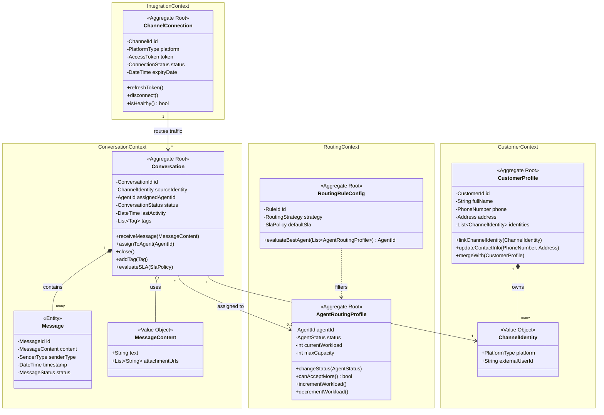

# TÀI LIỆU THIẾT KẾ DOMAIN-DRIVEN DESIGN (DDD)
## HỆ THỐNG QUẢN LÝ CHAT ĐA KÊNH TẬP TRUNG (OMNICHANNEL CHAT MANAGEMENT SYSTEM)

Dưới đây là bản thiết kế kiến trúc Domain Model cho dự án OCM dựa trên các nguyên tắc của DDD.

---

### 1. UBIQUITOUS LANGUAGE (Ngôn ngữ chung)
Sự thống nhất ngôn ngữ giữa Business và Technical team:
* **Agent (Nhân viên tư vấn):** Người trực tiếp trả lời tin nhắn.
* **Conversation (Hội thoại):** Một phiên giao tiếp liên tục giữa Customer và Agent qua một Channel.
* **Message (Tin nhắn):** Đơn vị giao tiếp nhỏ nhất trong một Conversation.
* **Channel (Kênh):** Nền tảng bên ngoài (Facebook, Zalo, Shopee, TikTok) được kết nối vào hệ thống.
* **Routing (Điều hướng):** Hành động phân phối một Conversation cho một Agent cụ thể.
* **SLA (Service Level Agreement):** Cam kết thời gian phản hồi (ví dụ: tin nhắn phải được trả lời trong 3 phút).
* **Customer Profile (Hồ sơ khách hàng):** Tập hợp thông tin định danh của khách hàng trên nhiều Channels.

---

### 2. BOUNDED CONTEXTS (Các giới hạn bối cảnh)
Hệ thống được chia thành 4 Bounded Contexts cốt lõi:
1.  **Conversation Context (Core):** Quản lý vòng đời hội thoại, tin nhắn, và tương tác trực tiếp.
2.  **Routing Context (Core):** Đảm nhiệm logic phân chia công việc, theo dõi trạng thái Agent và giám sát SLA.
3.  **Customer Context (Supporting):** (Mini CRM) Quản lý định danh, hợp nhất thông tin khách hàng từ nhiều nguồn.
4.  **Integration Context (Supporting):** Cầu nối (Anti-Corruption Layer) với các API bên thứ 3 (Facebook, Shopee, v.v.), quản lý Token và Webhook.

---

### 3. AGGREGATES, ENTITIES & VALUE OBJECTS

#### 3.1. Bounded Context: Conversation Context
* **Aggregate Root: `Conversation`**
    * **Lý do tồn tại (Why):** `Conversation` là ranh giới giao dịch (Transactional Boundary) cốt lõi của giao tiếp. Khi một tin nhắn mới được thêm vào, trạng thái hội thoại (Unassigned -> Open), cờ SLA, và thời gian cập nhật cuối cùng phải được thay đổi đồng thời trong một transaction duy nhất để đảm bảo tính nhất quán (Consistency).
    * **Entities bên trong:** `Message` (chỉ có thể được tạo thông qua `Conversation`).
    * **Value Objects:** `ConversationId`, `MessageContent` (Text, Attachments), `Tags`.
    * **Behaviors (Rich Model):** 
        * `receiveMessage(MessageContent)`: Thêm tin nhắn, cập nhật thời gian, tính toán lại SLA.
        * `assignToAgent(AgentId)`: Cập nhật trạng thái sang `Open`, gán quyền sở hữu.
        * `close()`: Đóng hội thoại, đánh dấu hoàn tất.
        * `addTag(Tag)`: Phân loại hội thoại.

#### 3.2. Bounded Context: Routing Context
* **Aggregate Root: `AgentRoutingProfile`**
    * **Lý do tồn tại (Why):** Tránh tình trạng tranh chấp (Race Condition) khi hệ thống chia chat đồng thời. Ranh giới giao dịch này khóa (lock) Agent lại khi đang gán một hội thoại để kiểm tra xem tải làm việc hiện tại (Workload) có vượt mức hay không, và trạng thái có đang `Online` hay không.
    * **Value Objects:** `AgentStatus` (Online, Busy, Offline), `RoutingCapacity`.
    * **Behaviors:**
        * `changeStatus(AgentStatus)`: Thay đổi trạng thái sẵn sàng.
        * `incrementWorkload()`: Tăng số lượng chat đang xử lý.
        * `decrementWorkload()`: Giảm số lượng chat khi đóng hội thoại.
* **Aggregate Root: `RoutingRuleConfig`**
    * **Lý do tồn tại (Why):** Lưu trữ và quản lý cấu hình các thuật toán (Round-robin, Customer Retention) của toàn hệ thống.

#### 3.3. Bounded Context: Customer Context
* **Aggregate Root: `CustomerProfile`**
    * **Lý do tồn tại (Why):** Thông tin khách hàng tồn tại độc lập với hội thoại. Một khách hàng có thể có nhiều `ChannelIdentity` (vừa chat FB, vừa chat Zalo). Ranh giới này đảm bảo việc hợp nhất hồ sơ (Merge Profiles) không làm sai lệch dữ liệu định danh.
    * **Value Objects:** `PhoneNumber`, `Address`, `ChannelIdentity` (Provider, ExternalId).
    * **Behaviors:**
        * `linkChannelIdentity(ChannelIdentity)`: Gắn thêm ID từ mạng xã hội khác.
        * `updateContactInfo(PhoneNumber, Address)`: Cập nhật CRM.

#### 3.4. Bounded Context: Integration Context
* **Aggregate Root: `ChannelConnection`**
    * **Lý do tồn tại (Why):** Quản lý trạng thái kết nối độc lập. Nếu Token hết hạn, chỉ Aggregate này bị ảnh hưởng (đổi status sang Disconnected) mà không phá vỡ dữ liệu lịch sử hội thoại.
    * **Value Objects:** `AccessToken`, `PlatformType`.
    * **Behaviors:** `refreshToken()`, `disconnect()`.

---

### 4. DOMAIN SERVICES
*Domain Services chứa các logic nghiệp vụ liên kết nhiều Aggregates mà không thuộc hẳn về Aggregate nào.*
* **`ConversationRouterService` (Routing Context):** Lắng nghe sự kiện hội thoại mới, lấy luật từ `RoutingRuleConfig`, tìm kiếm `AgentRoutingProfile` phù hợp nhất và gọi lệnh gán (`Conversation.assignToAgent()`).
* **`SlaMonitorService` (Routing Context):** Quét các `Conversation` định kỳ (hoặc qua Event Scheduler). Nếu phát hiện vi phạm SLA, kích hoạt hành động thu hồi hội thoại và cảnh báo Supervisor.
* **`CustomerMergerService` (Customer Context):** Chứa logic so khớp (Matching logic) số điện thoại hoặc ID để hợp nhất 2 `CustomerProfile` thành một định danh duy nhất.

---

### 5. DOMAIN EVENTS
Sử dụng Event-Driven Architecture để các Bounded Contexts giao tiếp lỏng lẻo (Loosely Coupled) với nhau (thường qua Message Broker như Kafka/RabbitMQ).
* `IntegrationMessageReceived` -> Kích hoạt tạo `Conversation` và `Message`.
* `ConversationStarted` -> Kích hoạt `ConversationRouterService` để tìm người.
* `ConversationAssigned` -> Kích hoạt `AgentRoutingProfile.incrementWorkload()`.
* `ConversationClosed` -> Kích hoạt `AgentRoutingProfile.decrementWorkload()`.
* `SlaBreached` -> Kích hoạt Re-routing và gửi cảnh báo.
* `CustomerProfileMerged` -> Cập nhật lại lịch sử các hội thoại cũ sang ID mới.

---

### 6. SƠ ĐỒ LỚP (MERMAID CLASS DIAGRAM)

### 7. TỔNG KẾT VỀ RANG BUỘC GIAO DỊCH (TRANSACTIONAL BOUNDARIES)
Trong kiến trúc DDD này:
1. Bạn không được phép thay đổi trực tiếp `Message` từ bên ngoài. Mọi tin nhắn mới phải đi qua hành vi `conversation.receiveMessage()`. Điều này giúp `Conversation` luôn kiểm soát được trạng thái đóng/mở và cờ vi phạm SLA của chính nó.
2. Logic phân phối chat (Routing) không nằm trong `Conversation` mà nằm ở `Domain Service` để phối hợp giữa `Conversation` (chat nào cần người) và `AgentRoutingProfile` (ai đang rảnh rỗi).
3. `CustomerProfile` và `Conversation` có sự liên kết lỏng (Loosely coupled) thông qua `ChannelIdentity`. Dù khách hàng đổi số điện thoại hay gộp hồ sơ, các hội thoại lịch sử vẫn giữ nguyên tính toàn vẹn thông qua External User ID của nền tảng gửi tới.
