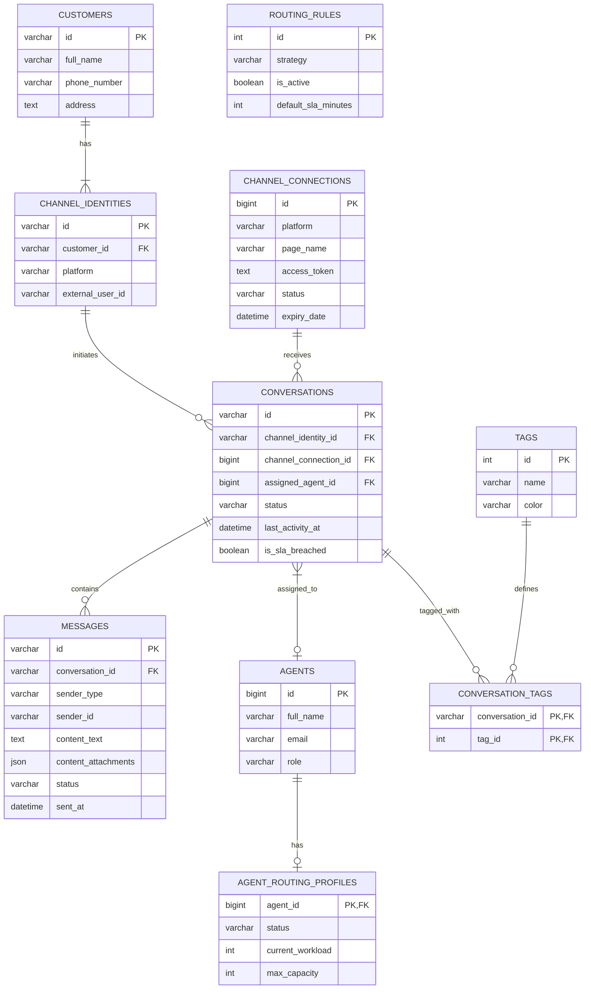

# TÀI LIỆU THIẾT KẾ CƠ SỞ DỮ LIỆU (DATABASE DESIGN)
## HỆ THỐNG QUẢN LÝ CHAT ĐA KÊNH TẬP TRUNG (OCM)

Tài liệu này cung cấp thiết kế Cơ sở dữ liệu quan hệ (Relational Database) chuẩn Production cho hệ thống OCM, sử dụng **MySQL 8.0**. Thiết kế đã được chuẩn hóa đến mức 3NF (Third Normal Form) để tránh dư thừa dữ liệu, đồng thời tối ưu hóa Indexes cho các truy vấn Read/Write cường độ cao (cập nhật tin nhắn thời gian thực).

---

### 1. SƠ ĐỒ THỰC THỂ KẾT HỢP (MERMAID ERD)



---

### 2. CHIẾN LƯỢC ĐÁNH CHỈ MỤC (INDEX STRATEGY) & TỐI ƯU HIỆU SUẤT

Để đảm bảo hệ thống có thể xử lý `15,000 requests/phút` (như đã định nghĩa trong PRD), việc thiết lập Index là bắt buộc.

1. **Bảng `messages`:**
   - Cực kỳ phình to theo thời gian.
   - `INDEX idx_conversation_sent (conversation_id, sent_at DESC)`: Tối ưu cho truy vấn lấy lịch sử chat của một hội thoại theo thứ tự thời gian.
2. **Bảng `conversations`:**
   - `INDEX idx_agent_status_activity (assigned_agent_id, status, last_activity_at DESC)`: Rất quan trọng để hiển thị Inbox cho từng Agent (lọc theo trạng thái Open và sắp xếp theo tin nhắn mới nhất).
   - `INDEX idx_sla_monitor (status, last_activity_at)`: Dành riêng cho Background Worker quét các hội thoại vi phạm SLA (quá hạn 3 phút chưa trả lời).
3. **Bảng `channel_identities`:**
   - `UNIQUE INDEX uniq_platform_external (platform, external_user_id)`: Đảm bảo tính duy nhất. Khi có Webhook trả về từ FB/Zalo, ta có thể dùng `INSERT ... ON DUPLICATE KEY UPDATE` để tìm nhanh User này.
4. **Bảng `customers`:**
   - `INDEX idx_phone (phone_number)`: Dùng để tìm kiếm và gợi ý gộp (Merge) hồ sơ khách hàng.

---

### 3. RÀNG BUỘC (CONSTRAINTS) VÀ TOÀN VẸN DỮ LIỆU
* **Primary Keys (Khóa chính):**
  - Các bảng cấu hình hoặc nhỏ (`agents`, `tags`, `channel_connections`): Dùng `BIGINT AUTO_INCREMENT` để tiết kiệm dung lượng index.
  - Các bảng giao dịch khối lượng lớn (`messages`, `conversations`, `customers`): Dùng `VARCHAR(36)` lưu UUIDv4 (hoặc chuỗi Snowflake ID) để thuận tiện cho việc Sharding (phân mảnh DB) hoặc tạo ID phân tán (Distributed ID generation) trong tương lai.
* **Foreign Keys (Khóa ngoại):**
  - `ON DELETE RESTRICT`: Không cho phép xóa `Customer` nếu họ đang có `ChannelIdentity`, hoặc không cho phép xóa `Conversation` nếu vẫn còn `Messages`. Điều này ngăn chặn việc vô tình xóa mất lịch sử chat quan trọng.
* **JSON Type:** - Cột `content_attachments` trong bảng `messages` dùng kiểu `JSON` của MySQL để chứa mảng các URL hình ảnh/file. Điều này giúp linh hoạt không cần tạo thêm bảng `attachments` rườm rà.

---

### 4. SQL DDL (DATA DEFINITION LANGUAGE)

Dưới đây là script tạo bảng chi tiết cho MySQL 8.0:

```sql
-- ==========================================
-- 1. CONFIGURATION & MASTER DATA TABLES
-- ==========================================

CREATE TABLE agents (
    id BIGINT AUTO_INCREMENT PRIMARY KEY,
    full_name VARCHAR(255) NOT NULL,
    email VARCHAR(255) UNIQUE NOT NULL,
    role ENUM('ADMIN', 'SUPERVISOR', 'AGENT') DEFAULT 'AGENT',
    created_at DATETIME DEFAULT CURRENT_TIMESTAMP,
    updated_at DATETIME DEFAULT CURRENT_TIMESTAMP ON UPDATE CURRENT_TIMESTAMP
) ENGINE=InnoDB DEFAULT CHARSET=utf8mb4 COLLATE=utf8mb4_unicode_ci;

CREATE TABLE agent_routing_profiles (
    agent_id BIGINT PRIMARY KEY,
    status ENUM('ONLINE', 'BUSY', 'OFFLINE') DEFAULT 'OFFLINE',
    current_workload INT DEFAULT 0,
    max_capacity INT DEFAULT 10,
    updated_at DATETIME DEFAULT CURRENT_TIMESTAMP ON UPDATE CURRENT_TIMESTAMP,
    CONSTRAINT fk_routing_profile_agent FOREIGN KEY (agent_id) REFERENCES agents(id) ON DELETE CASCADE
) ENGINE=InnoDB DEFAULT CHARSET=utf8mb4 COLLATE=utf8mb4_unicode_ci;

CREATE TABLE routing_rules (
    id INT AUTO_INCREMENT PRIMARY KEY,
    strategy ENUM('ROUND_ROBIN', 'CUSTOMER_RETENTION', 'LOAD_BALANCING') NOT NULL,
    is_active BOOLEAN DEFAULT TRUE,
    default_sla_minutes INT DEFAULT 3,
    created_at DATETIME DEFAULT CURRENT_TIMESTAMP
) ENGINE=InnoDB;

CREATE TABLE tags (
    id INT AUTO_INCREMENT PRIMARY KEY,
    name VARCHAR(100) NOT NULL UNIQUE,
    color VARCHAR(20) DEFAULT '#FFFFFF'
) ENGINE=InnoDB DEFAULT CHARSET=utf8mb4;

-- ==========================================
-- 2. INTEGRATION & CUSTOMER CONTEXT
-- ==========================================

CREATE TABLE channel_connections (
    id BIGINT AUTO_INCREMENT PRIMARY KEY,
    platform ENUM('FACEBOOK', 'ZALO', 'SHOPEE', 'TIKTOK') NOT NULL,
    page_name VARCHAR(255) NOT NULL,
    access_token TEXT NOT NULL,
    refresh_token TEXT,
    status ENUM('CONNECTED', 'DISCONNECTED', 'ERROR') DEFAULT 'CONNECTED',
    expiry_date DATETIME,
    created_at DATETIME DEFAULT CURRENT_TIMESTAMP,
    updated_at DATETIME DEFAULT CURRENT_TIMESTAMP ON UPDATE CURRENT_TIMESTAMP
) ENGINE=InnoDB DEFAULT CHARSET=utf8mb4 COLLATE=utf8mb4_unicode_ci;

CREATE TABLE customers (
    id VARCHAR(36) PRIMARY KEY,
    full_name VARCHAR(255) NOT NULL,
    phone_number VARCHAR(20),
    address TEXT,
    created_at DATETIME DEFAULT CURRENT_TIMESTAMP,
    updated_at DATETIME DEFAULT CURRENT_TIMESTAMP ON UPDATE CURRENT_TIMESTAMP,
    INDEX idx_phone (phone_number)
) ENGINE=InnoDB DEFAULT CHARSET=utf8mb4 COLLATE=utf8mb4_unicode_ci;

CREATE TABLE channel_identities (
    id VARCHAR(36) PRIMARY KEY,
    customer_id VARCHAR(36) NOT NULL,
    platform ENUM('FACEBOOK', 'ZALO', 'SHOPEE', 'TIKTOK') NOT NULL,
    external_user_id VARCHAR(255) NOT NULL,
    created_at DATETIME DEFAULT CURRENT_TIMESTAMP,
    CONSTRAINT fk_identity_customer FOREIGN KEY (customer_id) REFERENCES customers(id) ON DELETE RESTRICT,
    UNIQUE INDEX uniq_platform_external (platform, external_user_id)
) ENGINE=InnoDB DEFAULT CHARSET=utf8mb4 COLLATE=utf8mb4_unicode_ci;

-- ==========================================
-- 3. CONVERSATION CONTEXT (TRANSACTIONAL)
-- ==========================================

CREATE TABLE conversations (
    id VARCHAR(36) PRIMARY KEY,
    channel_identity_id VARCHAR(36) NOT NULL,
    channel_connection_id BIGINT NOT NULL,
    assigned_agent_id BIGINT NULL,
    status ENUM('UNASSIGNED', 'OPEN', 'CLOSED') DEFAULT 'UNASSIGNED',
    last_activity_at DATETIME DEFAULT CURRENT_TIMESTAMP,
    is_sla_breached BOOLEAN DEFAULT FALSE,
    created_at DATETIME DEFAULT CURRENT_TIMESTAMP,
    updated_at DATETIME DEFAULT CURRENT_TIMESTAMP ON UPDATE CURRENT_TIMESTAMP,
    
    CONSTRAINT fk_conv_identity FOREIGN KEY (channel_identity_id) REFERENCES channel_identities(id) ON DELETE RESTRICT,
    CONSTRAINT fk_conv_connection FOREIGN KEY (channel_connection_id) REFERENCES channel_connections(id) ON DELETE RESTRICT,
    CONSTRAINT fk_conv_agent FOREIGN KEY (assigned_agent_id) REFERENCES agents(id) ON DELETE SET NULL,
    
    INDEX idx_agent_status_activity (assigned_agent_id, status, last_activity_at DESC),
    INDEX idx_sla_monitor (status, last_activity_at)
) ENGINE=InnoDB DEFAULT CHARSET=utf8mb4 COLLATE=utf8mb4_unicode_ci;

CREATE TABLE messages (
    id VARCHAR(36) PRIMARY KEY,
    conversation_id VARCHAR(36) NOT NULL,
    sender_type ENUM('CUSTOMER', 'AGENT', 'SYSTEM') NOT NULL,
    sender_id VARCHAR(255) NULL, -- external_user_id or agent_id depending on sender_type
    content_text TEXT,
    content_attachments JSON,
    status ENUM('SENT', 'DELIVERED', 'READ', 'FAILED') DEFAULT 'SENT',
    sent_at DATETIME DEFAULT CURRENT_TIMESTAMP,
    
    CONSTRAINT fk_msg_conversation FOREIGN KEY (conversation_id) REFERENCES conversations(id) ON DELETE RESTRICT,
    INDEX idx_conversation_sent (conversation_id, sent_at DESC)
) ENGINE=InnoDB DEFAULT CHARSET=utf8mb4 COLLATE=utf8mb4_unicode_ci;

CREATE TABLE conversation_tags (
    conversation_id VARCHAR(36) NOT NULL,
    tag_id INT NOT NULL,
    assigned_at DATETIME DEFAULT CURRENT_TIMESTAMP,
    PRIMARY KEY (conversation_id, tag_id),
    CONSTRAINT fk_ct_conversation FOREIGN KEY (conversation_id) REFERENCES conversations(id) ON DELETE CASCADE,
    CONSTRAINT fk_ct_tag FOREIGN KEY (tag_id) REFERENCES tags(id) ON DELETE CASCADE
) ENGINE=InnoDB;
```

---

### 5. QUY TẮC LƯU GIỮ DỮ LIỆU (DATA RETENTION RULES)

Hệ thống Chat sinh ra lượng dữ liệu rác (ảnh, video, text lịch sử) rất khổng lồ. Cần áp dụng quy tắc Retention như sau để Database MySQL không bị thắt cổ chai (Bottleneck):
1. **Hot Data (Dữ liệu nóng):** Giữ lại trên MySQL Database (Bảng `messages`) các tin nhắn trong vòng **6 tháng gần nhất**.
2. **Cold Data (Dữ liệu lạnh):** Các tin nhắn cũ hơn 6 tháng được một job chạy ngầm (Cronjob/Airflow) chuyển sang kho lưu trữ giá rẻ hơn như **AWS S3** (định dạng Parquet) hoặc Data Warehouse (Google BigQuery / ClickHouse) để phục vụ tra cứu lịch sử và báo cáo, sau đó `DELETE` khỏi MySQL.
3. **Attachments:** Bảng `messages` tuyệt đối KHÔNG lưu file vật lý. Tất cả file upload lên Amazon S3 / MinIO, chỉ lưu `URL` vào cột `content_attachments` (định dạng JSON).

---

### 6. KẾ HOẠCH MIGRATION & SCALABILITY (MIGRATION PLAN)

* **Công cụ quản lý version:** Sử dụng **Flyway** hoặc **Liquibase** để version hóa script SQL. Đảm bảo mọi thay đổi cấu trúc sau này đều được theo dõi và có khả năng Rollback.
* **Scale-up (Mở rộng):** Trong tương lai, khi lượng tin nhắn (`messages`) vượt quá hàng chục triệu record/tháng, ta sẽ sử dụng kỹ thuật **Table Partitioning** trên bảng `messages` chia theo RANGE của cột `sent_at` (Partition theo từng tháng). Việc này giúp drop data cũ rất nhanh (chỉ cần `DROP PARTITION`) và tối ưu quét Index.
* **Tách Read/Write Replica:** Mọi truy vấn Insert/Update (nhận tin nhắn) chọc thẳng vào Master DB. Mọi truy vấn Read (Xem báo cáo thống kê, load lịch sử tin nhắn) điều hướng qua Slave (Read Replica DB) để giảm tải khóa dòng (Row-level lock).
