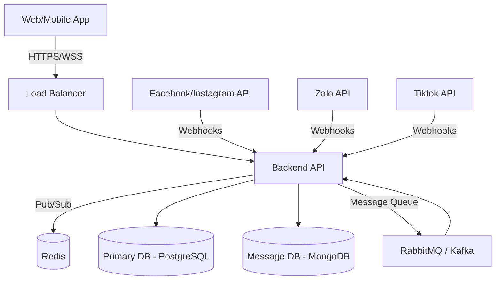

# Architecture Overview

Hệ thống OmniChat được thiết kế để xử lý lượng tương tác lớn theo thời gian thực (Real-time).

## 1. Sơ đồ kiến trúc mức cao (High-Level Architecture)

## 2. Luồng xử lý tin nhắn (Message Flow)
1. Khách hàng nhắn tin vào Fanpage/Zalo OA.
2. Nền tảng (Facebook/Zalo) gọi Webhook gửi dữ liệu tới API của hệ thống.
3. Hệ thống chuẩn hóa dữ liệu tin nhắn, đẩy vào hàng đợi (Message Queue) để xử lý bất đồng bộ.
4. Background Worker (hoặc Consumer) xử lý tin nhắn, lưu vào Database (MongoDB).
5. Hệ thống phát sự kiện qua **Redis Pub/Sub** tới các WebSocket đang kết nối.
6. Giao diện frontend của nhân viên tự động cập nhật tin nhắn mới theo thời gian thực.
