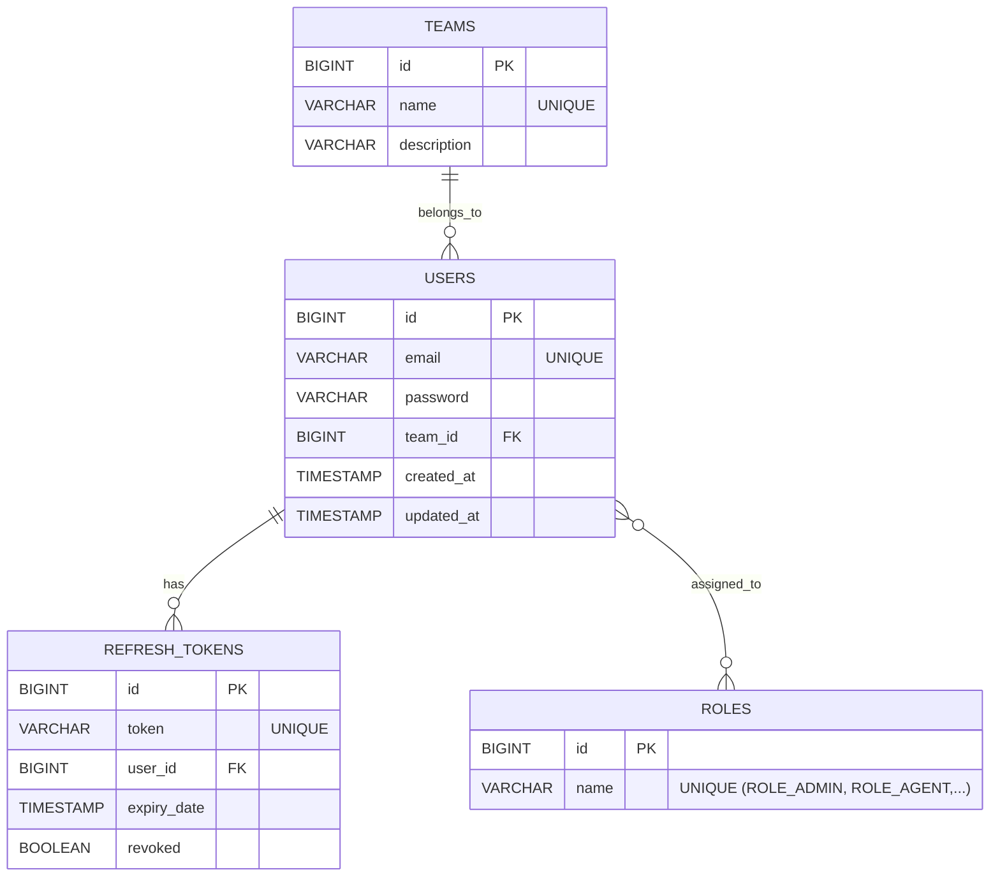

# Auth Service

## Giới thiệu
Module `auth-service` chịu trách nhiệm quản lý người dùng (Agent, Supervisor, Admin) trong hệ thống Omnichannel.
Nó đảm nhận việc cấp phát JWT Token (Access Token & Refresh Token) thông qua mã hoá RSA, phân quyền người dùng cơ bản (RBAC), và quản lý trạng thái token.

## Yêu cầu môi trường
- Java 21
- Maven
- MySQL 8.x
- Redis

## Cài đặt
Chạy lệnh build tại thư mục `backend`:
```bash
mvn clean install -pl auth-service -am
```

## Biến môi trường
- `SPRING_DATASOURCE_URL`: JDBC URL tới MySQL.
- `SPRING_DATASOURCE_USERNAME`: User DB.
- `SPRING_DATASOURCE_PASSWORD`: Pass DB.
- `JWT_PRIVATE_KEY`: Private Key để ký Access Token.
- `JWT_PUBLIC_KEY`: Public Key.
- `SPRING_REDIS_HOST`: Redis host.

## Database ERD (Entity-Relationship Diagram)



## Chạy ứng dụng
```bash
cd backend
mvn spring-boot:run -pl auth-service
```
Dịch vụ sẽ tự động chạy Flyway migration để tạo bảng. Nó kết nối qua port `8081` và tự register lên Eureka Server.
