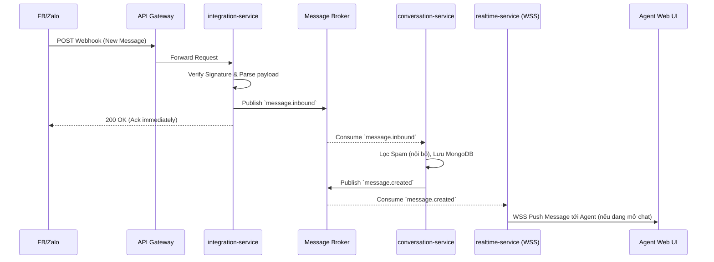
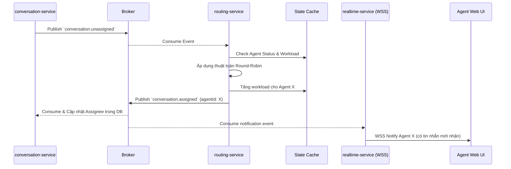
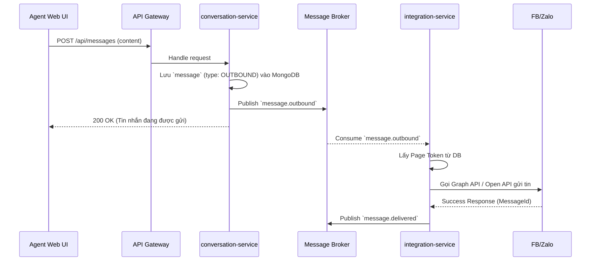

# High-Level Design (HLD) - OmniChat

Tài liệu thiết kế kiến trúc tổng thể (High-Level Design) cho hệ thống OmniChat, dựa trên danh sách Bounded Context và phân tách thành các Microservices thực tế.

---

## 1. Định nghĩa Microservices

Từ 12 module chức năng lõi, hệ thống được gom nhóm (cohesion) thành **10 Microservices** độc lập để tối ưu hóa hiệu năng, giảm overhead gọi mạng (network hop) và dễ dàng mở rộng (scale):

| Tên Microservice | Chức năng (Các Module bao gồm) | Vai trò |
|---|---|---|
| `auth-service` | M01 (Identity & Access) | Độc lập hoàn toàn, chịu trách nhiệm xác thực tập trung. |
| `tenant-service` | M02 (Tenant & Org) | Quản lý data core về shop/team, tách biệt với Auth. |
| `integration-service` | M03 (Channel Integration) | Tách biệt logic kết nối Webhook 1-1 (FB, Zalo). |
| `livestream-service` | M04 (Livestream Connector)<br>M05 (Chat Aggregator) | Cùng thuộc Livestream domain. Gom chung giúp giảm độ trễ khi chuyển raw comment thành aggregated data. |
| `customer-service` | M06 (Customer Management) | Quản lý CRM, profile, độc lập với chat. |
| `conversation-service`| M07 (Conversation & Inbox)<br>M08 (Spam Filter) | Việc lọc spam diễn ra nội bộ ngay khi nhận tin, giúp tiết kiệm 1 network hop cho mỗi tin nhắn. |
| `routing-service` | M09 (Routing & Assignment) | Scale độc lập và giữ state của Agent trên Redis. |
| `realtime-service` | M10 (Realtime Delivery) | Chuyên maintain hàng ngàn connection WebSocket. Tránh ảnh hưởng CPU của các service xử lý logic. |
| `analytics-service` | M11 (Analytics & Reporting) | Xử lý data lớn (OLAP), query nặng, tách riêng hoàn toàn. |
| `notification-service`| M12 (Notification) | Chuyên xử lý push/email background, tách khỏi luồng chính. |

---

## 2. Component Diagram (Kiến trúc tổng thể)

Biểu đồ dưới đây mô tả sự tương tác giữa các microservices, cơ sở dữ liệu, bộ nhớ đệm (Cache), Message Broker và các hệ thống bên ngoài.

```mermaid
graph TD
    %% External Systems
    subgraph "External Platforms"
        EXT_MSG[Facebook/Zalo/Insta]
        EXT_LIVE[TikTok/Shopee/YT Live]
    end

    %% Client Apps
    subgraph "Clients"
        WEB[Web App (Admin/Agent)]
        MOB[Mobile App]
    end

    %% API Gateway
    GW[API Gateway / Load Balancer]
    WEB --> GW
    MOB --> GW
    EXT_MSG -- Webhook --> GW
    EXT_LIVE -- Webhook/WSS --> GW

    %% Message Broker & Cache
    KAFKA[[Message Broker: Kafka/RabbitMQ]]
    REDIS[(Redis Cache / PubSub)]

    %% Services
    subgraph "OmniChat Microservices"
        AUTH(auth-service)
        TENANT(tenant-service)
        INTEG(integration-service)
        LIVE(livestream-service)
        CUST(customer-service)
        CONV(conversation-service)
        ROUT(routing-service)
        RT(realtime-service)
        ANALYT(analytics-service)
        NOTI(notification-service)
    end

    %% Databases
    DB_ID[(PostgreSQL: Identity)]
    DB_TENANT[(PostgreSQL: Tenant)]
    DB_CUST[(PostgreSQL: CRM)]
    DB_CHAT[(MongoDB: Chat/Inbox)]
    DB_ANALYTICS[(ClickHouse/ES: Analytics)]

    %% Gateway Routing
    GW --> AUTH
    GW --> TENANT
    GW --> INTEG
    GW --> LIVE
    GW --> CUST
    GW --> CONV
    GW --> ANALYT
    
    %% WSS Routing
    GW -- WSS --> RT

    %% Sync Comm
    TENANT -. gRPC/REST .-> AUTH
    INTEG -. gRPC/REST .-> AUTH
    INTEG -. gRPC/REST .-> TENANT
    CONV -. gRPC/REST .-> CUST

    %% Async Comm (Broker)
    INTEG -->|Inbound Msg| KAFKA
    LIVE -->|Live Comment| KAFKA
    KAFKA --> CONV
    CONV -->|New Thread| KAFKA
    KAFKA --> ROUT
    ROUT -->|Assigned| KAFKA
    KAFKA --> ANALYT
    KAFKA --> NOTI
    KAFKA --> RT

    %% Data Ownership
    AUTH --- DB_ID
    TENANT --- DB_TENANT
    CUST --- DB_CUST
    CONV --- DB_CHAT
    ANALYT --- DB_ANALYTICS
    ROUT --- REDIS
    RT --- REDIS
```

---

## 3. Giao tiếp giữa các Service (Sync vs Async)

Để đảm bảo hiệu năng và tính rời rạc (Decoupling), hệ thống sử dụng kết hợp cả 2 hình thức giao tiếp:

### Giao tiếp đồng bộ (Synchronous - REST / gRPC)
**Được sử dụng khi:** Yêu cầu phản hồi ngay lập tức để quyết định luồng logic tiếp theo, hoặc khi truy vấn dữ liệu không thay đổi quá thường xuyên.
- **`tenant-service` -> `auth-service`:** Xác thực phân quyền, kiểm tra tài khoản khi mời thành viên. (Ưu tiên gRPC để giảm latency).
- **`integration-service` -> `tenant-service`:** Lấy cấu hình Channel Token để verify Webhook gửi về từ Facebook/Zalo.
- **`conversation-service` -> `customer-service`:** Lấy thông tin hiển thị Profile khách hàng khi Agent mở khung chat.

### Giao tiếp bất đồng bộ (Asynchronous - Kafka / RabbitMQ)
**Được sử dụng khi:** Cần xử lý background, chịu tải cao (spikes), không cần phản hồi ngay (Fire-and-forget), và decouple các dịch vụ.
- **`integration-service` / `livestream-service` -> `conversation-service` (Inbound Messages):** Khi có hàng ngàn tin nhắn/comment dội về cùng lúc, Integration/Livestream service chỉ việc parse và đẩy vào Kafka. Conversation service sẽ consume theo tốc độ của nó, tránh bị nghẽn DB.
- **`conversation-service` -> `routing-service` (Routing Request):** Khi có hội thoại mới, Conversation service bắn event lên Kafka. Routing service sẽ nhặt event để tìm Agent phù hợp và gán, sau đó bắn event ngược lại.
- **Tất cả service -> `analytics-service` / `notification-service`:** Analytics và Notification lắng nghe event (Event Sourcing) để thống kê và gửi push, không ảnh hưởng đến luồng chat chính.

---

## 4. Data Ownership (Quyền sở hữu dữ liệu)

Áp dụng mô hình **Database-per-service** để đảm bảo tính độc lập. Tuyệt đối không có 2 service kết nối trực tiếp vào cùng 1 Database vật lý/logic.

1. **`auth-service` (Identity DB - PostgreSQL):** Lưu `users`, `roles`, `permissions`, `credentials`.
2. **`tenant-service` (Tenant DB - PostgreSQL):** Lưu `tenants`, `teams`, `tenant_members`, `SLA_configs`.
3. **`integration-service` & `livestream-service` (Integration DB - PostgreSQL):** Lưu `channels`, `oauth_tokens`, `webhook_logs`, thông tin phiên live.
4. **`customer-service` (Customer DB - PostgreSQL):** Lưu `customers`, `channel_identities` (mapping 1 khách hàng có nhiều id facebook/zalo).
5. **`conversation-service` (Conversation DB - MongoDB):** Lưu `conversations`, `messages`, `attachments`, config lọc spam. (Dùng NoSQL do tính chất schema-less và lượng dữ liệu khổng lồ).
6. **`routing-service` (Routing DB - Redis):** Lưu trạng thái Agent (Online/Busy), Agent Workload, Queue hội thoại chờ.
7. **`analytics-service` (Analytics DB - ClickHouse / ElasticSearch):** Lưu event logs, aggregated metrics để query báo cáo siêu tốc.

---

## 5. Sequence Diagram: 3 Luồng nghiệp vụ quan trọng

### Luồng 1: Nhận tin nhắn từ nền tảng (Inbound Messaging)


### Luồng 2: Phân bổ hội thoại tự động (Routing & Assignment)


### Luồng 3: Agent gửi tin nhắn trả lời (Outbound Messaging)


---

## 6. Đảm bảo tính nhất quán (Consistency)

- **Eventual Consistency (Chấp nhận nhất quán cuối cùng):** Được áp dụng cho phần lớn hệ thống để tối ưu hiệu năng.
  - *Ví dụ:* Gửi tin nhắn chat, phân bổ agent, cập nhật báo cáo. Nếu Kafka trễ 1-2 giây, báo cáo có thể nhảy số chậm một chút nhưng không ảnh hưởng nghiêm trọng tới kinh doanh.
- **Strong Consistency (Nhất quán tức thì):** Áp dụng cho các vùng lõi nhạy cảm như *Thanh toán/Billing*, *Đăng ký Tenant*, *Quản lý phân quyền*.
- **Cơ chế đảm bảo (Reliability Patterns):**
  - **Outbox Pattern:** Các Service (như `tenant-service`, `conversation-service`) khi lưu data vào Database sẽ đồng thời lưu một event vào bảng `outbox` cùng chung 1 Transaction. Một process (CDC - Debezium hoặc Poller) sẽ quét bảng này để đẩy lên Kafka, đảm bảo không bao giờ bị mất event (At-least-once delivery).
  - **Saga Pattern:** Áp dụng khi tạo mới Tenant (gồm tạo Tenant ở `tenant-service` + tạo User ở `auth-service` + khởi tạo config ở các service khác). Nếu 1 bước lỗi, bắn bù trừ (Compensation Transaction) để rollback dữ liệu.

---

## 7. Yêu cầu phi chức năng (Non-Functional Requirements)

1. **Khả năng chịu tải (Spike Traffic) khi Livestream:**
   - Trong livestream, lượng comment có thể đạt hàng chục ngàn / giây.
   - **Giải pháp:** `livestream-service` không ghi trực tiếp vào DB mà đẩy toàn bộ comment vào Kafka. Sử dụng Redis làm In-memory Buffer. `conversation-service` sẽ consume theo cơ chế Batching (Insert nhiều document cùng lúc vào MongoDB) để tránh sập DB.
   - Sử dụng Kubernetes HPA (Horizontal Pod Autoscaling) để tự động scale số lượng container cho `livestream-service` và `conversation-service` dựa trên độ trễ Kafka Lag.
2. **Chiến lược Retry & Failover khi nền tảng ngoài (Facebook/Zalo) bị downtime:**
   - **Gửi tin lỗi:** Nếu API của Zalo/Facebook trả về lỗi 5xx, `integration-service` áp dụng **Exponential Backoff Retry** (thử lại sau 2s, 4s, 8s...). 
   - Nếu số lần retry quá giới hạn, đẩy tin nhắn vào **Dead Letter Queue (DLQ)** để chờ Admin xử lý hoặc cảnh báo cho Agent.
   - **Circuit Breaker:** Sử dụng Resilience4j. Nếu Facebook API lỗi liên tục vượt quá giới hạn (VD: > 50% trong 1 phút), ngắt mạch (Open) để tránh cạn kiệt tài nguyên thread pool, và trả về lỗi nhanh (Fail-fast) cho Agent.
3. **Độ trễ thấp (Low Latency):** 
   - Yêu cầu tin nhắn từ lúc khách hàng gửi đến lúc hiển thị trên màn hình Agent phải < 1 giây (p95).
   - Sử dụng `realtime-service` chuyên dụng với Redis Pub/Sub và WebSocket để push data song song, không phụ thuộc vào tải của logic server.
