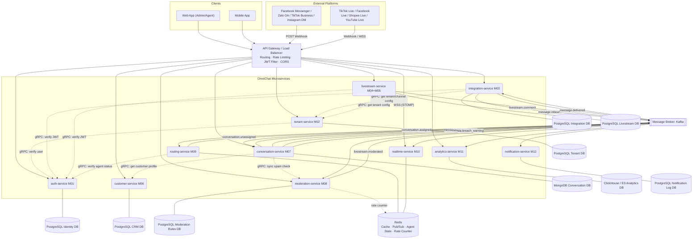
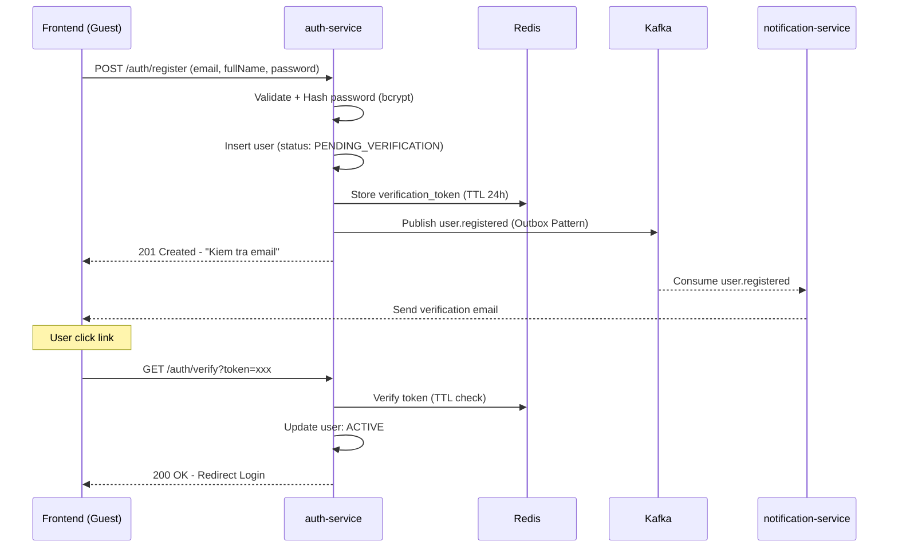
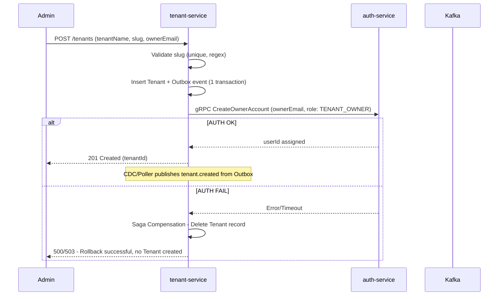
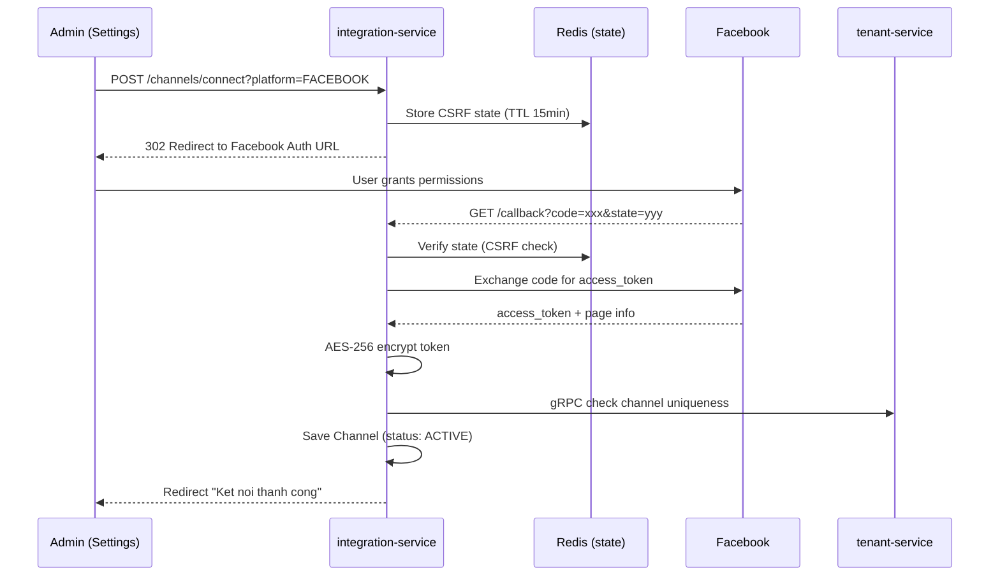
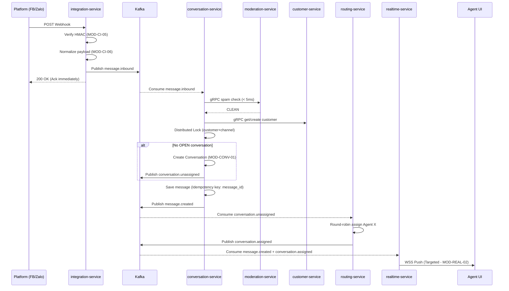
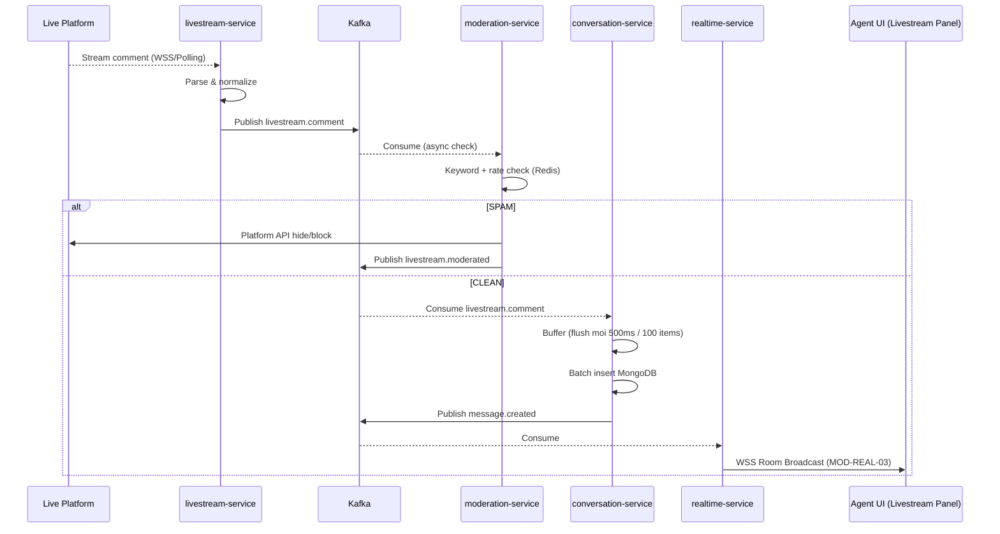
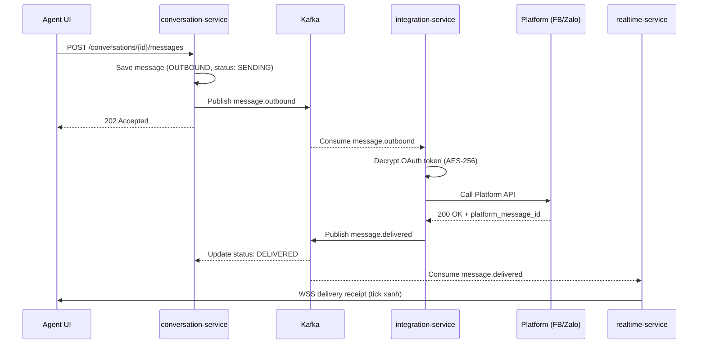
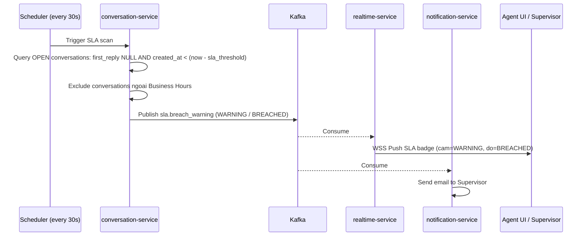
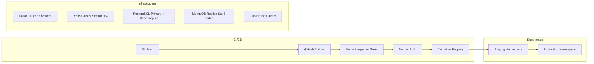

# High-Level Design (HLD) — OmniChat

> **Dự án:** OmniChat — Hệ thống quản lý tin nhắn & kênh chat livestream đa nền tảng  
> **Phiên bản:** 2.1  
> **Cập nhật lần cuối:** 2026-07-24  
> **Tham chiếu:**
> - [`MODULES.md`](./MODULES.md) — Bản đồ Bounded Context
> - [`PROJECT_PLAN.md`](./PROJECT_PLAN.md) — Tiến độ triển khai
> - [`M01-identity-access/`](./M01-identity-access/) — FEATURES & REQUIREMENTS
> - [`M02-tenant-organization/`](./M02-tenant-organization/) — FEATURES & REQUIREMENTS
> - [`M03-channel-integration/`](./M03-channel-integration/) — FEATURES & REQUIREMENTS
> - [`M07-conversation-inbox/`](./M07-conversation-inbox/) — FEATURES & REQUIREMENTS
> - [`M10-realtime-delivery/`](./M10-realtime-delivery/) — FEATURES & REQUIREMENTS

Tài liệu thiết kế kiến trúc tổng thể (HLD) cho OmniChat, tổng hợp từ Bounded Context (MODULES.md), tiến độ triển khai (PROJECT_PLAN.md) và yêu cầu chức năng chi tiết (REQUIREMENTS/FEATURES từng module). Mọi quyết định kiến trúc đều hướng đến: **hoạt động ổn định** và **có thể mở rộng / cải thiện trong tương lai**.

---

## 1. Định nghĩa Microservices

Từ 13 module (M00–M12), hệ thống gom nhóm thành **11 Microservices** độc lập:

| # | Service | Module | Chức năng chính | Lý do tách |
|---|---|---|---|---|
| 1 | `auth-service` | M01 | Đăng ký, đăng nhập (Local + Google SSO), JWT (issue/refresh/blacklist), RBAC | Xác thực tập trung toàn hệ thống |
| 2 | `tenant-service` | M02 | CRUD Tenant, Team, Member, Business Hours, SLA Policy | Scale riêng biệt với Auth |
| 3 | `integration-service` | M03 | OAuth2 connect/disconnect, auto-refresh token, webhook receive/verify, normalize inbound, send outbound | Tách logic kết nối kênh 1-1 |
| 4 | `livestream-service` | M04+M05 | Kết nối live platform, quản lý phiên, gom comment, buffer, rate control, reply command | Cùng domain livestream, giảm latency |
| 5 | `customer-service` | M06 | CRUD Customer Profile, Channel Identity mapping, merge profile | CRM độc lập với luồng chat |
| 6 | `conversation-service` | M07 | Tạo/đóng conversation, lưu message, Unified Inbox, filter/search, tagging, quick reply, SLA tracking, Private Replies | Core inbox — nhận từ cả 1-1 và livestream |
| 7 | `moderation-service` | M08 | Spam filter realtime (keyword + rate), auto-hide comment live, tenant blacklist, moderation report | Swap AI/rule engine không ảnh hưởng inbox |
| 8 | `routing-service` | M09 | Agent status (online/busy/offline), round-robin assignment, workload, transfer, fallback | Scale độc lập, state trên Redis |
| 9 | `realtime-service` | M10 | WebSocket management (heartbeat), targeted push, room broadcast, multi-instance Pub/Sub, presence sync | CPU profile khác biệt với logic service |
| 10 | `analytics-service` | M11 | Dashboard realtime, báo cáo kênh/agent/SLA, export, so sánh phiên live | OLAP query nặng — tách riêng |
| 11 | `notification-service` | M12 | In-app, email, push notification (hội thoại mới, SLA breach, assignment, live start) | Background push — tách khỏi luồng chính |

> **v2.1:** `moderation-service` tách riêng khỏi `conversation-service` để đảm bảo **Single Responsibility** và dễ nâng cấp engine spam.

---

## 2. Component Diagram (Kiến trúc tổng thể)



---

## 3. Dependency Map

| Module | Service | Phụ thuộc | Tiến độ (PROJECT_PLAN) |
|---|---|---|---|
| M00 — Platform Infrastructure | Gateway, Kafka, Redis | — | ⏳ Chờ |
| M01 — Identity & Access | `auth-service` | M00 | 🔄 MOD-IAM-01 done |
| M02 — Tenant & Organization | `tenant-service` | M01 | ⏳ Chờ |
| M03 — Channel Integration | `integration-service` | M01, M02 | ⏳ Chờ |
| M04 — Livestream Connector | `livestream-service` | M01, M02 | ⏳ Chờ |
| M05 — Livestream Chat Aggregator | `livestream-service` | M04 | ⏳ Chờ |
| M06 — Customer Management | `customer-service` | M01, M02 | ⏳ Chờ |
| M07 — Conversation & Inbox | `conversation-service` | M03, M05, M06 | ⏳ Chờ |
| M08 — Spam Filter & Moderation | `moderation-service` | M02 | ⏳ Chờ |
| M09 — Routing & Assignment | `routing-service` | M01, M07 | ⏳ Chờ |
| M10 — Realtime Delivery | `realtime-service` | M07, M09 | ⏳ Chờ |
| M11 — Analytics & Reporting | `analytics-service` | M07, M02 | ⏳ Chờ |
| M12 — Notification | `notification-service` | M07, M10 | ⏳ Chờ |

---

## 4. Giao tiếp giữa các Service

### 4.1 Synchronous (gRPC ưu tiên / REST fallback)

| Caller | Callee | Mục đích | Latency target |
|---|---|---|---|
| `tenant-service` | `auth-service` | Verify user khi mời thành viên | < 50ms |
| `integration-service` | `auth-service` | Verify JWT cho webhook nội bộ | < 30ms |
| `integration-service` | `tenant-service` | Lấy channel config / OAuth token | < 50ms |
| `livestream-service` | `auth-service` | Verify token khi quản lý phiên live | < 30ms |
| `livestream-service` | `tenant-service` | Lấy cấu hình tenant & Business Hours | < 50ms |
| `conversation-service` | `customer-service` | Lấy/tạo customer profile khi nhận tin đầu tiên | < 50ms |
| `conversation-service` | `moderation-service` | Spam check đồng bộ (outbound nhạy cảm) | < 5ms |
| `routing-service` | `auth-service` | Verify agent khi cập nhật trạng thái | < 30ms |

### 4.2 Asynchronous (Kafka Topics)

| Topic | Publisher | Subscribers | Trigger |
|---|---|---|---|
| `user.registered` | `auth-service` | `notification-service` | Đăng ký xong → gửi email xác thực |
| `tenant.created` | `tenant-service` | `integration-service`, `customer-service`, `analytics-service` | Tenant mới → khởi tạo workspace |
| `tenant.updated` | `tenant-service` | `analytics-service` | Thay đổi tenant info |
| `message.inbound` | `integration-service` | `conversation-service` | Tin nhắn 1-1 từ platform |
| `livestream.comment` | `livestream-service` | `conversation-service`, `moderation-service` | Comment từ phiên live |
| `conversation.unassigned` | `conversation-service` | `routing-service` | Hội thoại mới cần assign agent |
| `message.created` | `conversation-service` | `realtime-service`, `analytics-service`, `notification-service` | Tin nhắn đã lưu DB |
| `conversation.assigned` | `routing-service` | `conversation-service`, `realtime-service`, `notification-service` | Agent được assign |
| `message.outbound` | `conversation-service` | `integration-service` | Agent gửi tin nhắn ra platform |
| `message.delivered` | `integration-service` | `conversation-service`, `realtime-service`, `analytics-service` | Platform xác nhận tin |
| `livestream.moderated` | `moderation-service` | `realtime-service`, `analytics-service` | Comment bị block |
| `sla.breach_warning` | `conversation-service` | `notification-service`, `realtime-service` | SLA sắp/đã vi phạm |
| `user.offline` | `realtime-service` | `routing-service` | Agent mất kết nối WebSocket |

---

## 5. Data Ownership (Database-per-service)

**Nguyên tắc:** Không có 2 service kết nối cùng 1 DB. Truy vấn chéo service chỉ qua API hoặc event.

| Service | DB | Schema chính | Yêu cầu kỹ thuật đặc biệt |
|---|---|---|---|
| `auth-service` | PostgreSQL | `users` (PENDING_VERIFICATION/ACTIVE/LOCKED/SUSPENDED, failed_login_attempts, lockout_end, auth_provider, password nullable), `roles`, `permissions`, `credentials`, `token_blacklist`, `verification_tokens` (Redis TTL 24h), `refresh_tokens` (revoked, expiry_date) | Email Global Unique; bcrypt/Argon2 hash; Timing Attack resistant |
| `tenant-service` | PostgreSQL | `tenants` (slug unique), `teams`, `tenant_members`, `sla_configs`, `business_hours`, `outbox` | Optimistic Locking (version field); Audit log mọi thay đổi |
| `integration-service` | PostgreSQL | `channels` (ACTIVE/INACTIVE), `oauth_tokens` (AES-256 encrypted), `webhook_logs`, `outbound_queue`, `oauth_states` (Redis TTL 15min) | Token mã hóa AES-256 at rest; Channel unique toàn hệ thống |
| `livestream-service` | PostgreSQL | `livestream_sessions` (LIVE/ENDED), `platform_connections`, `live_tokens` | Session lifecycle management |
| `customer-service` | PostgreSQL | `customers`, `channel_identities` (1 customer ↔ nhiều platform_id), `merge_history` | Multi-channel identity mapping |
| `conversation-service` | MongoDB | `conversations` (OPEN/CLOSED/PENDING/SPAM, sla_due_at), `messages` (INBOUND/OUTBOUND, SENDING/DELIVERED), `quick_reply_templates`, `tags` | Idempotency key (message_id); Distributed Lock Redis; Batch insert cho livestream |
| `moderation-service` | PostgreSQL + Redis | `spam_rules`, `keyword_blacklists` per tenant (PG); `rate_counters` per sender (Redis TTL) | Redis rate check < 5ms |
| `routing-service` | Redis | `agent_status`, `agent_workload`, `conversation_queue` | Sub-millisecond R/W; TTL sau UserOfflineEvent |
| `analytics-service` | ClickHouse / ES | `event_logs`, `aggregated_metrics`, `reports` | OLAP query; Event Sourcing từ Kafka |
| `realtime-service` | Redis (Pub/Sub only) | `session_map` (userId → Set<sessionId>), `online_users` | Không persist; Multi-tab; Max 10,000 conn/node (50KB RAM/conn) |
| `notification-service` | PostgreSQL | `notification_logs`, `delivery_status`, `retry_count` | Audit trail; retry tracking |

---

## 6. Functional Requirements — Tổng hợp từ REQUIREMENTS files

### M01 — Identity & Access

| Mã | Chức năng | Business Rules nổi bật | Edge Cases |
|---|---|---|---|
| MOD-IAM-01 | Đăng ký tài khoản | Email Global Unique; Password min 8 ký tự (hoa+thường+số+ký tự đặc biệt); Rate limit 5 req/IP/h; Verification token TTL 24h | Email PENDING: gửi lại link, không báo lỗi; Gửi email lỗi → Outbox Pattern; Race condition → DB Unique Constraint |
| MOD-IAM-02 | Đăng nhập Local | Trả về Access Token + Refresh Token (JWT) | Brute force → lock account |
| MOD-IAM-03 | Google OAuth2 SSO | Auto-create hoặc link account với Google email | Email trùng local account → link account |
| MOD-IAM-04 | Refresh JWT | Refresh token còn hạn → cấp Access Token mới (Rotation: 1 lần dùng) | Replay attack → token đã dùng bị reject |
| MOD-IAM-05 | Logout & Blacklist | Blacklist Access Token (Redis); xóa Refresh Token; broadcast TokenBlacklistedEvent | Force logout all sessions của user |
| MOD-IAM-06 | Role Management | Super Admin only | Không xóa role đang được gán cho user |
| MOD-IAM-07 | Permission/RBAC | Gán Permission vào Role; Hệ thống phân quyền theo tenant | Cascade khi xóa Permission |
| MOD-IAM-08 | Get Current Profile | Giải mã JWT → trả về user info, roles, permissions, tenants | Token hết hạn → 401; Token blacklisted → 401 |

**NFR M01:** API đăng ký < 500ms (email gửi async); Password hash bắt buộc; Timing Attack resistant.

### M02 — Tenant & Organization

| Mã | Chức năng | Business Rules nổi bật | Edge Cases |
|---|---|---|---|
| MOD-TENANT-01 | Tạo Tenant (Onboarding) | slug unique toàn hệ thống (regex `^[a-z0-9-]+$`, 3-50 ký tự); Rate limit 3 tenant/IP/h | Saga: rollback nếu M01 lỗi; slug race condition → DB Unique; Outbox Pattern cho event |
| MOD-TENANT-02 | Cập nhật hồ sơ Tenant | slug KHÔNG được sửa; Optimistic Locking (version); Tenant Admin hoặc Super Admin | Concurrent update → 409 Conflict |
| MOD-TENANT-03 | Quản lý trạng thái Tenant | Super Admin only; SUSPENDED → block all member login | Cascade force-close WebSocket sessions |
| MOD-TENANT-04 | Tạo Team | Tenant Admin only; Tên team unique trong tenant | |
| MOD-TENANT-05 | Cập nhật Team | Tenant Admin only | |
| MOD-TENANT-06 | Xóa/Vô hiệu hóa Team | Unlink all members trước; reassign hội thoại đang gán cho team | |
| MOD-TENANT-07 | Mời thành viên vào Tenant | Verify user tồn tại ở M01; Gán Role per Tenant; Email mời nếu chưa có account | |
| MOD-TENANT-08 | Gán vào Team | User phải là member của Tenant trước | |
| MOD-TENANT-09 | Remove Member | Lập tức revoke access; unassign hội thoại đang xử lý | |
| MOD-TENANT-10 | Business Hours | Cấu hình per tenant per weekday; Dùng để pause SLA timer ngoài giờ | |
| MOD-TENANT-11 | SLA Policy | First Response Time & Resolution Time per tenant; Chỉ áp dụng cho conversation MỚI | Thay đổi SLA không retroactive |

**NFR M02:** Tạo Tenant < 2s; Strong Consistency M02 ↔ M01 (Saga); Audit log mọi admin action.

### M03 — Channel Integration

| Mã | Chức năng | Business Rules nổi bật | Edge Cases |
|---|---|---|---|
| MOD-CI-01 | OAuth2 Connect | Channel unique toàn hệ thống; CSRF state Redis TTL 15min; Scope đủ (pages_messaging, pages_manage_metadata...); Token AES-256 at rest | User từ chối → không lưu; Platform API lỗi → báo lỗi; Channel Inactive → update token |
| MOD-CI-02 | Disconnect Channel | Revoke token trên platform; xóa webhook subscription; Cảnh báo nếu có hội thoại đang mở | |
| MOD-CI-03 | Auto-refresh Token | Cronjob kiểm tra trước khi hết hạn; Exponential Backoff retry | DLQ nếu retry hết lần → cảnh báo Admin |
| MOD-CI-04 | Tiếp nhận Webhook | Ack ngay 200 OK; xử lý hoàn toàn async; Idempotency cho replay | |
| MOD-CI-05 | Verify Webhook Signature | HMAC validation bắt buộc trước khi xử lý payload | Fake webhook → 403 Forbidden; log incident |
| MOD-CI-06 | Inbound Normalization | Raw payload → unified format; Channel Adapter per platform | Unsupported message type → log & skip |
| MOD-CI-07 | Outbound Delivery | Retry Exponential Backoff (2s/4s/8s/16s) → DLQ; Circuit Breaker (Resilience4j) | Platform down → DLQ → Admin dashboard alert |

**NFR M03:** OAuth Callback < 2-3s; Webhook ack < 200ms; Token mã hóa AES-256.

### M07 — Conversation & Inbox

| Mã | Chức năng | Business Rules nổi bật | Edge Cases |
|---|---|---|---|
| MOD-CONV-01 | Tạo mới hội thoại | Chỉ 1 OPEN/PENDING per Customer per Channel; Session Window reset SLA khi hội thoại mới | Duplicate event → Idempotency (message_id); Race Condition → Distributed Lock Redis (customer_id+channel_id); DB lỗi → DLQ |
| MOD-CONV-02 | Cập nhật trạng thái | OPEN/CLOSED/PENDING/SPAM; Auto-close scheduler sau X giờ không tương tác | |
| MOD-CONV-03 | Lưu & đồng bộ tin nhắn | INBOUND/OUTBOUND type; Batch insert cho livestream comment; Idempotency key | |
| MOD-CONV-04 | Filter & Search Inbox | Theo status/channel/time/tag/agent; Full-text search MongoDB | |
| MOD-CONV-05 | Conversation Tagging | Agent/Admin/Auto-tagging; Tag per tenant | |
| MOD-CONV-06 | Quick Reply Templates | CRUD per tenant; Agent sử dụng trong chat | |
| MOD-CONV-07 | SLA Tracking | Đọc SLA config từ M02; Scheduler mỗi 30s; WARNING (còn 20% thời gian) / BREACHED; Pause ngoài Business Hours | |
| MOD-CONV-08 | Private Replies (Facebook) | Chỉ Facebook Fanpage; Giới hạn 7 ngày từ comment; 1 lần duy nhất per comment_id; Gửi qua M03 | Facebook API lỗi → báo Agent rõ lý do; Double-click → Backend lock per comment_id |

**NFR M07:** Tạo hội thoại < 50ms; Throughput 200-500 req/s; Private Reply end-to-end < 2s.

### M10 — Realtime Delivery

| Mã | Chức năng | Business Rules nổi bật | Edge Cases |
|---|---|---|---|
| MOD-REAL-01 | WebSocket Connection Management | JWT auth tại handshake; Multi-tab (1 user → nhiều session, push tất cả); Heartbeat timeout 60s; Max 10,000 conn/node | Reconnection Storm → Exponential Backoff + Jitter; Token hết hạn → lắng nghe TokenBlacklistedEvent; C10K → OS Ulimit config |
| MOD-REAL-02 | Targeted Event Push | Kafka event → push đúng user_id qua tất cả session | User offline → skip; event buffered |
| MOD-REAL-03 | Group/Room Broadcast | Broadcast livestream comment tới tất cả agent trong Room | Large room → Redis Pub/Sub fan-out |
| MOD-REAL-04 | Multi-instance Pub/Sub | Redis Pub/Sub sync cross-instance | Redis down → degraded mode (mất realtime, không mất data) |
| MOD-REAL-05 | Presence/Status Sync | Khi session cuối disconnect → publish user.offline → routing-service ngừng assign | Heartbeat timeout 60s trigger |

**NFR M10:** Handshake < 100ms; RAM < 50KB/connection; 10,000 concurrent conn/node (1GB RAM, CPU < 60%).

---

## 7. Sequence Diagrams

### Luồng 1: Đăng ký & Xác thực (MOD-IAM-01)



### Luồng 2: Onboarding Tenant (MOD-TENANT-01 — Saga)



### Luồng 3: Kết nối kênh OAuth2 (MOD-CI-01)



### Luồng 4: Nhận tin nhắn 1-1 Inbound (M03 → M07 → M09 → M10)



### Luồng 5: Nhận comment Livestream (M04 → M08 → M07 → M10)



### Luồng 6: Agent gửi tin nhắn Outbound (M07 → M03)



### Luồng 7: SLA Tracking & Alert (M07 Scheduler → M12 → M10)



### Luồng 8: WebSocket Connect & Presence (MOD-REAL-01, MOD-REAL-05)

```mermaid
sequenceDiagram
    participant BROWSER as Agent Browser
    participant GW as API Gateway
    participant RT as realtime-service
    participant Redis as Redis

    BROWSER->>GW: WS Upgrade (token=JWT)
    GW->>RT: Route to M10 node
    RT->>RT: Verify JWT
    RT->>Redis: SADD online_users {userId}; HSET session_map {userId: sessionId}
    RT-->>BROWSER: 101 Switching Protocols + CONNECTED message

    Note over BROWSER,RT: Heartbeat every 30s
    BROWSER->>RT: PING
    RT-->>BROWSER: PONG

    Note over BROWSER,RT: Agent closes tab / loses network
    RT->>Redis: Remove session; Check if last session of userId
    alt Last session
        RT->>Kafka: Publish user.offline (userId)
        Kafka-->>ROUT: routing-service ngung assign cho agent nay
    end
```

---

## 8. Consistency Strategies

### 8.1 Phân loại

| Vùng | Chiến lược | Pattern | Ví dụ |
|---|---|---|---|
| **Strong Consistency** | ACID trong cùng service | DB Transaction | Đăng ký user, cấp phân quyền, lưu OAuth token |
| **Eventual Consistency** | Event-driven qua Kafka | Outbox + CDC | Lưu tin nhắn, phân bổ agent, update analytics |
| **Cross-service Transaction** | Choreography Saga | Compensation Event | Onboarding Tenant (M02 + M01) |

### 8.2 Reliability Patterns

| Pattern | Service áp dụng | Mục đích |
|---|---|---|
| **Outbox Pattern** | `tenant-service`, `auth-service`, `conversation-service` | Không mất event khi service crash giữa chừng |
| **Saga (Choreography)** | `tenant-service` ↔ `auth-service` | Rollback cross-service khi một bước lỗi |
| **Idempotency Key** | `conversation-service` (message_id), `integration-service` | Duplicate Kafka message không gây data trùng |
| **Distributed Lock (Redis)** | `conversation-service` | Chống race condition khi tạo conversation |
| **Optimistic Locking** | `tenant-service` (version field) | Chống concurrent update hồ sơ Tenant |
| **Dead Letter Queue** | `integration-service`, `conversation-service` | Message không xử lý được sau N retry |

---

## 9. Non-Functional Requirements (NFR)

### 9.1 Performance SLA

| Chỉ số | Target | Source |
|---|---|---|
| Tin nhắn → hiển thị Agent UI | < 1s (p95) | Architecture |
| Tạo hội thoại mới | < 50ms | MOD-CONV-01 |
| Spam check đồng bộ | < 5ms | M08 design |
| WebSocket handshake | < 100ms | MOD-REAL-01 |
| API đăng ký user | < 500ms | MOD-IAM-01 |
| Private Reply end-to-end | < 2s | MOD-CONV-08 |
| OAuth Callback | < 2-3s | MOD-CI-01 |
| Tạo Tenant (Onboarding) | < 2s | MOD-TENANT-01 |
| Throughput Livestream comment | > 10,000 comment/s | Architecture |
| Concurrent WebSocket conn/node | > 10,000 | MOD-REAL-01 |

### 9.2 Scalability

- **Stateless services:** Scale horizontal behind Load Balancer.
- **Kubernetes HPA:** Auto-scale theo Kafka Consumer Lag cho `livestream-service`, `conversation-service`, `integration-service`.
- **Kafka Partition by `tenant_id`:** Ordering trong tenant + phân tải đều giữa consumer instances.
- **Channel Adapter Pattern:** Thêm platform mới = thêm 1 Adapter class, không sửa core `integration-service`.
- **Moderation Engine Plugin:** Interface `SpamFilter` → swap rule-based sang AI model seamlessly.

### 9.3 Retry & Failover

| Scenario | Giải pháp |
|---|---|
| Platform API lỗi khi gửi outbound | Exponential Backoff (2s→4s→8s→16s) → DLQ |
| Platform API lỗi liên tục | Circuit Breaker (Resilience4j): >50% error/min → Open → Fail-fast |
| Kafka Consumer thất bại | Retry 3 lần backoff → DLQ topic |
| Auth/Tenant service down | Circuit Breaker + cached config fallback |
| WebSocket Reconnection Storm | Backend rate-limit; Client Exponential Backoff + Jitter |
| JWT hết hạn trong WebSocket session | Listen `TokenBlacklistedEvent` → force close session |

### 9.4 Security

| Layer | Cơ chế | Source |
|---|---|---|
| API Gateway | JWT validate mọi request; Rate limit (tenant_id + IP) | M01, M03 |
| Service-to-service | mTLS cho gRPC | Architecture |
| Webhook inbound | HMAC Signature Verification bắt buộc | MOD-CI-05 |
| OAuth token | AES-256 encryption at rest | MOD-CI-01 |
| Password | bcrypt/Argon2 hash; không lưu plaintext | MOD-IAM-01 |
| CSRF | OAuth state param (Redis TTL 15min) | MOD-CI-01 |
| Tenant isolation | tenant_id từ JWT; DB query luôn filter by tenant_id | Architecture |
| WebSocket | JWT tại handshake; Force disconnect khi token blacklisted | MOD-REAL-01 |

### 9.5 Observability

| Trụ cột | Công nghệ | Key Signals |
|---|---|---|
| **Distributed Tracing** | OpenTelemetry + Jaeger/Tempo | Trace webhook → MongoDB; Trace WebSocket push |
| **Metrics** | Prometheus + Grafana | Kafka Consumer Lag; p95/p99 latency; WebSocket conn count; Error rate |
| **Logging** | ELK Stack | Structured JSON; searchable by trace_id, tenant_id, conversation_id |
| **Alerting** | Alertmanager + PagerDuty | Kafka lag > threshold; Error rate > 1%; Pod down; DLQ non-empty |
| **Health Checks** | Spring Boot Actuator / gRPC Health | Kubernetes liveness/readiness probe |

### 9.6 Resilience

- **Kafka durability:** Retention 7 ngày; Consumer restart tiếp tục từ committed offset.
- **Redis Pub/Sub multi-instance:** Mọi `realtime-service` instance đều broadcast cross-instance.
- **Graceful Shutdown:** Flush buffer, ack Kafka offset, drain requests trước khi pod thoát.
- **Batch Insert:** Livestream comments buffer in-memory (flush mỗi 500ms hoặc 100 items) → giảm write amplification.

---

## 10. Deployment Strategy



| Service Type | Strategy | Lý do |
|---|---|---|
| Stateless services | Rolling Update (zero-downtime) | Không giữ state trong memory |
| Schema migration | Blue/Green Deploy | Tránh downtime khi thay đổi DB schema |
| `realtime-service` | Rolling + sticky session | Giảm reconnection storm |

**Config Management:** Kubernetes Secrets (credentials, AES key) + ConfigMap (app config). Không hardcode trong Docker image.  
**Service Mesh (optional):** Istio/Linkerd cho mTLS tự động, traffic shaping, observability.

---

## 11. Open Points & Quyết định cần chốt

| # | Vấn đề | Hiện trạng | Options | Ưu tiên |
|---|---|---|---|---|
| 1 | Message Broker | Chưa chốt | **Kafka** (throughput, retention, replay) vs **RabbitMQ** (đơn giản hơn) | 🔴 Cao — trước khi code M03 |
| 2 | Lưu Livestream comment | Chưa chốt | Lưu tất cả (full audit) vs chỉ lưu comment được reply | 🟡 Trung bình |
| 3 | gRPC vs REST nội bộ | gRPC ưu tiên | gRPC (latency thấp, typed) vs REST (dễ debug) | 🟡 Trung bình |
| 4 | Moderation engine | Rule-based MVP | Rule-based → tích hợp AI/ML sau | 🟢 Thấp (hướng rõ) |
| 5 | Multi-region | Single region | Vietnam vs Multi-region Asia | 🟢 Thấp — sau PMF |
| 6 | Private Reply scope | Chỉ Facebook | FB Fanpage confirmed; Instagram DM tương tự → confirm spec | 🟡 Trung bình |
| 7 | Billing/Subscription | Chưa có module | Stripe/PayOS vs module nội bộ | 🟢 Thấp — sau MVP |

---

> **📌 Single Source of Truth:** Mọi thay đổi kiến trúc phải cập nhật vào tài liệu này TRƯỚC khi implement.  
> Tham chiếu REQUIREMENTS từng module để lấy chi tiết business rule và acceptance criteria khi viết code.
