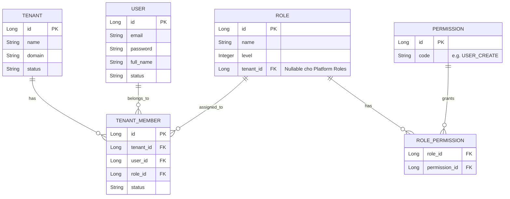
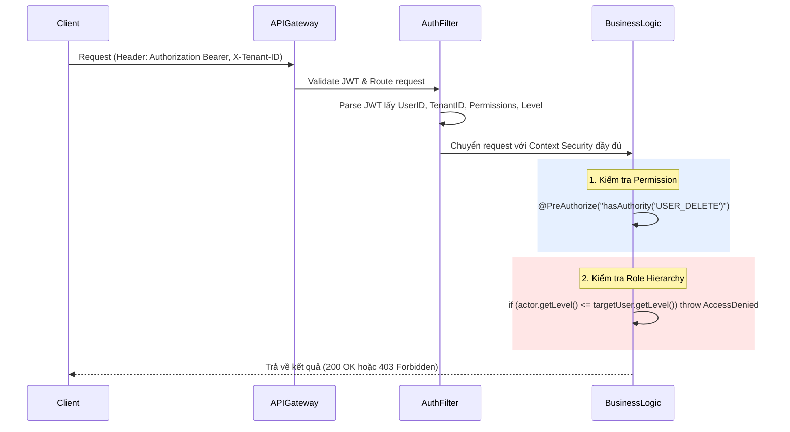

# Software Design Document (SDD): Account Management Strategy
**Module:** M13 - User Service
**Dự án:** OmniChat (Omnichannel Messaging Platform)

---

## 1. Kiến trúc tổng thể
Hệ thống OmniChat được thiết kế theo kiến trúc **Multi-Tenant SaaS (Software as a Service)**.

- **Sự phân tách:** Nền tảng (Platform) quản lý cơ sở hạ tầng dùng chung, trong khi đó mỗi khách hàng là một Tenant (Workspace) riêng biệt.
- **Cách ly dữ liệu (Data Isolation):** Mỗi Tenant hoàn toàn bị cô lập dữ liệu. Dữ liệu của Tenant A không thể được truy cập bởi Tenant B. 
- **Mở rộng (Scalability):** Kiến trúc này cho phép scale out (mở rộng theo chiều ngang) dễ dàng để hỗ trợ hàng chục nghìn Tenant hoạt động đồng thời trên cùng một hạ tầng.

### Sơ đồ luồng kết nối (ASCII Diagram)
```text
                          +-------------------------+
                          |   OmniChat Platform     |
                          | (System Admin, Support) |
                          +-----------+-------------+
                                      | Quản trị hệ thống, quản lý Tenant
+--------------------+                |               +--------------------+
|    Tenant A        |                v               |    Tenant B        |
| (Workspace A)      |<------------------------------>| (Workspace B)      |
| - Owner: Alice     |       (Data Isolation)         | - Owner: Bob       |
| - Admin: John      |                                | - Admin: Charlie   |
| - Agent: Mary      |                                | - Agent: David     |
+--------------------+                                +--------------------+
```

*Lý do chọn kiến trúc này:* Việc phân tách rõ ràng Platform và Tenant giúp code dễ bảo trì hơn, tách biệt các API quản trị hệ thống ra khỏi các API phục vụ nghiệp vụ hàng ngày của khách hàng.

---

## 2. Quản lý tài khoản
Hệ thống chia tài khoản thành 2 nhóm lớn có mục đích sử dụng hoàn toàn độc lập:

### 2.1. Platform Account (Tài khoản nội bộ nhà cung cấp)
Nhóm này phục vụ cho nhân sự của OmniChat để duy trì hệ thống. Nhóm này **không có quyền** can thiệp hay đọc tin nhắn của khách hàng.

| Role | Vai trò & Quyền hạn |
|------|----------------|
| **Super Admin** | Quyền cao nhất hệ thống, quản lý cả Platform Admin, thay đổi cấu hình lõi (Database, Caching, Broker). |
| **Platform Admin** | Quản lý danh sách Tenant, phê duyệt/khóa Tenant, cài đặt các gói cước (Billing Plans). |
| **Support** | Chỉ xem thông tin tổng quan của Tenant, check Audit Log hệ thống để hỗ trợ kỹ thuật, không thay đổi được dữ liệu. |

### 2.2. Tenant Account (Tài khoản khách hàng)
Mỗi tài khoản (User) sẽ thuộc vào một Tenant (Workspace) duy nhất. Tenant hoàn toàn tự chủ trong việc cấp quyền và mời nhân sự.

| Role | Mô tả |
|------|-------|
| **Owner** | Người tạo Workspace, sở hữu dữ liệu, quyền sinh sát cao nhất. |
| **Admin** | Quản trị viên của Tenant, thay mặt Owner quản lý cấu hình kênh, thiết lập rule, quản lý nhân sự. |
| **Manager** | Quản lý team, giám sát hiệu suất (Report), theo dõi cuộc hội thoại nhưng hạn chế các quyền cài đặt sâu. |
| **Supervisor** | Giám sát viên trực tiếp của các Agent, hỗ trợ xử lý tin nhắn khó. |
| **Agent** | Nhân viên CSKH/Sale, thao tác chính trên Inbox để chat với khách hàng. |

---

## 3. Chiến lược phân quyền (RBAC - Role-Based Access Control)

RBAC chia quyền thành các hạt nhỏ li ti (Permissions) thay vì dựa vào Role cố định. **Role chỉ đơn thuần là một nhóm (Group) các Permission.**

### Danh sách Permission mẫu:
- **Tài khoản:** `USER_CREATE`, `USER_UPDATE`, `USER_DELETE`, `USER_RESET_PASSWORD`, `ROLE_ASSIGN`
- **Kênh:** `CHANNEL_CONNECT`, `CHANNEL_DISCONNECT`, `CHANNEL_CONFIG`
- **Tin nhắn:** `CONVERSATION_ASSIGN`, `CONVERSATION_REPLY`, `CONVERSATION_CLOSE`
- **Báo cáo:** `REPORT_VIEW`, `REPORT_EXPORT`

*Nguyên tắc:* Code nghiệp vụ (trong Java Spring) chỉ check Permission (ví dụ: `@PreAuthorize("hasAuthority('USER_CREATE')")`), KHÔNG CHECK ROLE. Điều này giúp hệ thống siêu linh hoạt. Admin của Tenant có thể tạo thêm một custom role "Marketing" và nhét các Permission tương ứng vào.

---

## 4. Cơ chế Phân cấp Role (Role Hierarchy)

Việc chỉ dùng RBAC là không đủ cho một hệ thống SaaS. Hãy tưởng tượng Admin và Manager đều có quyền `USER_DELETE`, làm sao để chặn Manager xóa tài khoản của Admin?
-> Giải pháp là **Role Hierarchy (Cấp bậc Role)**.

Chúng ta gán cho mỗi Role một con số (Level):
- Owner = `Level 100`
- Admin = `Level 80`
- Manager = `Level 60`
- Supervisor = `Level 40`
- Agent = `Level 20`

*Lợi ích:* Tránh tình trạng lạm quyền (Privilege Escalation). Các Role cấp thấp dù có chung Permission cũng không thể tác động lên Role cấp cao hơn.

---

## 5. Quy tắc quản trị thành viên & 6. Đổi Role

Mọi thao tác quản lý nhân sự (Sửa/Khóa/Xóa/Đổi Role/Reset Pass) phải thỏa mãn **ĐỒNG THỜI 2 ĐIỀU KIỆN**:
1. **Quyền hạn (Permission Check):** Actor (người thao tác) phải có Permission tương ứng (VD: `USER_UPDATE`).
2. **Cấp bậc (Hierarchy Check):** `Actor.Level > Target.Level` (Cấp bậc của người thao tác phải lớn hơn người bị tác động).

### Quy tắc khi Gán / Đổi Role:
Khi Actor thay đổi Role của một Target (hoặc mời một Target mới vào), Role được cấp phải thỏa mãn:
`Actor.Level > AssignedRole.Level`

**Ví dụ thực tế:**
*Admin (Level 80) tiến hành tạo mới tài khoản.*
- Bảng chọn Role của Admin chỉ hiển thị các Role từ Manager (60) trở xuống.
- Admin KHÔNG THỂ tạo ra một Admin khác (vì 80 không lớn hơn 80).
- Admin KHÔNG THỂ xóa hoặc đổi pass của một Admin khác. Chỉ có Owner mới làm được.

---

## 7. Quy tắc đối với Chủ sở hữu (Owner)

Owner là vai trò siêu việt (Level 100) được hardcode một số quy tắc bất di bất dịch:
- Mỗi Tenant **CHỈ CÓ DUY NHẤT 1 OWNER**.
- Owner có toàn quyền, không cần check Permission (hoặc được ngầm định full permission).
- **Không thể bị xóa:** Không một ai kể cả Platform Admin có thể xóa Owner trừ khi xóa toàn bộ Tenant.
- **Transfer Ownership:** Owner có thể chuyển nhượng quyền sở hữu cho một thành viên khác.
  - *Luồng thực hiện:* Owner click "Transfer" -> Chọn một Admin -> Xác thực 2FA/Mật khẩu -> Hệ thống đổi Owner cũ thành Admin (Level 80) và Admin được chọn thành Owner mới (Level 100).

---

## 8. Thiết kế dữ liệu (Data Entity Model)

Chúng ta cần lưu trữ dữ liệu tập trung theo mô hình Database ERD như sau:



### Giải thích vai trò:
- **USER:** Lưu thông tin định danh toàn cục (Global Identity). Bất chấp việc đổi Workspace, thông tin đăng nhập của user là cố định.
- **TENANT (Workspace):** Không gian làm việc.
- **TENANT_MEMBER:** Bảng mapping (junction). Nó định nghĩa việc User này nằm trong Tenant nào, và đóng vai trò gì. Một User có thể có nhiều bản ghi Tenant_Member (nếu hệ thống cho phép 1 user tham gia nhiều Workspace).
- **ROLE & PERMISSION:** Hệ thống phân quyền. Level được lưu ở cột `level` trong bảng `ROLE`.

---

## 9. Luồng kiểm tra quyền (Authorization Flow)

Quy trình áp dụng trực tiếp cho Microservices (API Gateway + Auth Service + Các Service nghiệp vụ):



---

## 10. Best Practices áp dụng vào Java Spring Boot

Để hiện thực hóa tài liệu trên trong Java Spring Boot, chúng ta cần tuân thủ các nguyên tắc (Enterprise Standards):

### 10.1. Inject Hierarchy Check bằng AOP (Aspect-Oriented Programming)
Thay vì if/else check cấp bậc rải rác khắp nơi trong controller/service, hãy tạo một custom Annotation `@RequireHigherLevel` kết hợp với AOP interceptor:
```java
@Target(ElementType.METHOD)
@Retention(RetentionPolicy.RUNTIME)
public @interface RequireHigherLevel {
    String targetUserIdParam() default "targetId";
}
```
AOP Aspect sẽ tự động fetch Level của Actor (từ SecurityContext) và Target (từ DB) để so sánh trước khi cho hàm chạy.

### 10.2. Principle of Least Privilege (Quyền hạn tối thiểu)
Khi tạo mới một Role, mặc định Role đó không có bất kỳ Permission nào. Hệ thống bắt buộc quản trị viên phải tick chọn từng quyền. Hạn chế dùng wildcard kiểu `*.*`.

### 10.3. Soft Delete (Xóa mềm)
Với User và Member, tuyệt đối **KHÔNG DELETE CỨNG** (Hard delete). Sử dụng Hibernate `@SQLDelete(sql = "UPDATE users SET deleted = true WHERE id=?")` và `@Where(clause = "deleted=false")`. Việc này đảm bảo tính vẹn toàn cho các thống kê và tin nhắn cũ. Kể cả bị xóa, tên của Agent vẫn hiển thị trong lịch sử tin nhắn.

### 10.4. Audit Logging (Nhật ký kiểm toán)
Mọi thao tác quản lý nhân sự (Add, Remove, Change Role) phải được ghi log (Actor ID, Target ID, Action, Timestamp, IP). Có thể áp dụng Hibernate Envers hoặc `@EntityListeners(AuditingEntityListener.class)` kết hợp đẩy event ra Kafka để lưu vào hệ thống Logging (Elasticsearch/MongoDB) chuyên biệt.

### 10.5. Ngăn chặn Self-Destruction
Logic API phải cứng rắn:
- `if (actorId.equals(targetId))` -> Block các hành vi: Tự khóa tài khoản chính mình, tự hạ cấp Role của mình, tự xóa chính mình. Tránh trường hợp Tenant bị "vô chủ" hoặc không ai cứu được.

---
**Tổng kết ưu điểm:**
- **Tính bảo mật cao:** Kết hợp RBAC và Hierarchy chặt chẽ không có lỗ hổng thăng cấp quyền.
- **Tính mở rộng:** Rất dễ thêm Role mới bằng cách cấu hình Database, không phải release lại code. Dễ dàng bán các module Permission theo gói Subscription (Ví dụ: Gói Free không được gán permission Export).
- **Thực tiễn (Enterprise-ready):** Tách bạch rõ ràng Tenant Account và Platform Account giúp mô hình kinh doanh SaaS dễ dàng vận hành.
