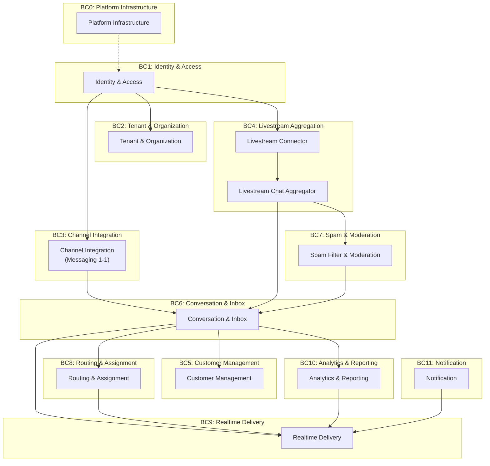

# MODULES.md — Bản đồ Module theo Bounded Context

> **Dự án:** OmniChat — Hệ thống quản lý tin nhắn & kênh chat livestream đa nền tảng  
> **Nền tảng mục tiêu:**  
> - **Messaging (1-1):** Facebook Messenger, Zalo OA, TikTok Business, Instagram DM  
> - **Livestream:** TikTok Live, Facebook Live, Shopee Live, YouTube Live  
> **Người dùng chính:** Seller livestream, đội CSKH (Customer Support), quản lý shop  
> **Ngày tạo:** 2026-07-20  
> **Trạng thái:** 🔵 Đang chờ xác nhận

---

## Tổng quan Bounded Contexts

---

## Bảng Module tổng hợp

| # | Tên Module | Bounded Context | Mục tiêu | Phạm vi trách nhiệm (LÀM gì) | KHÔNG làm gì | Phụ thuộc |
|---|---|---|---|---|---|---|
| M00 | **Platform Infrastructure** | BC0: Platform Infrastructure | Cung cấp nền tảng kỹ thuật chung (config, discovery, gateway, message broker) để tất cả module khác hoạt động | Config Server tập trung, Service Discovery, API Gateway (routing, rate limiting, JWT filter), CORS, Message Broker setup (Kafka/RabbitMQ) | Không chứa business logic; không xử lý dữ liệu nghiệp vụ | Không phụ thuộc module nào |
| M01 | **Identity & Access** | BC1: Identity & Access | Xác thực người dùng, phát hành/xác thực JWT, phân quyền RBAC | Đăng ký/đăng nhập, JWT (issue, refresh, introspect, blacklist), quản lý Role/Permission, Google OAuth2 SSO | Không quản lý tenant/shop; không quản lý kênh mạng xã hội | M00 (Platform Infrastructure) |
| M02 | **Tenant & Organization** | BC2: Tenant & Organization | Quản lý cấu trúc tổ chức multi-tenant: shop, team, cấu hình tenant | CRUD Tenant/Shop, quản lý Team trong tenant, gán user vào team/tenant, cấu hình nghiệp vụ theo tenant (giờ làm việc, SLA policy) | Không xác thực user; không quản lý permission hệ thống | M01 (Identity & Access) |
| M03 | **Channel Integration** | BC3: Channel Integration | Kết nối OAuth2 với nền tảng messaging 1-1 (Facebook Messenger, Zalo OA, TikTok, Instagram DM); nhận webhook inbound; gửi tin nhắn outbound | Luồng OAuth2 connect/disconnect kênh, nhận & verify webhook, chuẩn hóa tin nhắn inbound thành format chung, gửi outbound qua Platform API, auto-refresh token | Không xử lý livestream; không lưu hội thoại; không phân bổ hội thoại | M01 (Identity & Access), M02 (Tenant & Organization) |
| M04 | **Livestream Connector** | BC4: Livestream Aggregation | Kết nối và duy trì kết nối realtime tới các nền tảng livestream (TikTok Live, Facebook Live, Shopee Live, YouTube Live) | Quản lý phiên livestream (bắt đầu/kết thúc), kết nối API/WebSocket tới từng nền tảng livestream, nhận raw chat/comment stream, chuẩn hóa thành format chung, quản lý vòng đời token livestream | Không lọc spam; không thống kê; không gửi reply (delegate cho module khác); không xử lý tin nhắn 1-1 | M01 (Identity & Access), M02 (Tenant & Organization) |
| M05 | **Livestream Chat Aggregator** | BC4: Livestream Aggregation | Gom comment/chat từ nhiều phiên livestream đang diễn ra về 1 luồng hợp nhất, cho phép admin xem & trả lời | Hợp nhất stream chat từ nhiều nền tảng livestream, buffer & rate control, cho phép agent trả lời comment/chat (gửi lệnh reply về Livestream Connector), quản lý trạng thái phiên gom (live/ended) | Không kết nối trực tiếp tới nền tảng; không phân tích dữ liệu; không lưu trữ hội thoại dài hạn | M04 (Livestream Connector) |
| M06 | **Customer Management** | BC5: Customer Management | Quản lý hồ sơ khách hàng CRM, liên kết identity đa kênh, merge profile trùng lặp | Tạo/cập nhật Customer Profile, liên kết Channel Identity (1 customer ↔ nhiều kênh), merge profile, tìm kiếm khách hàng | Không lưu tin nhắn; không phân bổ hội thoại; không kết nối nền tảng | M01 (Identity & Access), M02 (Tenant & Organization) |
| M07 | **Conversation & Inbox** | BC6: Conversation & Inbox | Quản lý vòng đời hội thoại, Unified Inbox gom tin nhắn từ cả messaging 1-1 và livestream, lưu trữ lịch sử tin nhắn | Tạo/mở/đóng hội thoại, lưu tin nhắn (inbound + agent reply), SLA tracking, quick reply template, liệt kê & lọc hội thoại theo kênh/trạng thái/agent | Không kết nối trực tiếp nền tảng; không phân bổ agent (delegate cho Routing); không gửi outbound (delegate cho Integration/Livestream) | M03 (Channel Integration), M05 (Livestream Chat Aggregator), M06 (Customer Management) |
| M08 | **Spam Filter & Moderation** | BC7: Spam & Moderation | Lọc spam, phát hiện nội dung vi phạm, hỗ trợ moderation cho cả chat livestream và tin nhắn 1-1 | Lọc spam realtime (keyword blacklist, tần suất gửi), phát hiện nội dung nhạy cảm, auto-hide/block comment spam trong livestream, danh sách từ cấm theo tenant, báo cáo moderation | Không lưu trữ tin nhắn; không phân bổ hội thoại; không quản lý user/kênh | M02 (Tenant & Organization) |
| M09 | **Routing & Assignment** | BC8: Routing & Assignment | Phân bổ hội thoại tự động cho agent, quản lý trạng thái & workload agent | Quản lý trạng thái agent (online/busy/offline), round-robin assignment, workload capacity, điều chỉnh workload khi transfer, fallback khi không có agent | Không lưu tin nhắn; không gửi outbound; không push realtime tới UI | M01 (Identity & Access), M07 (Conversation & Inbox) |
| M10 | **Realtime Delivery** | BC9: Realtime Delivery | Push event realtime tới giao diện admin/agent qua WebSocket | Duy trì kết nối WebSocket/STOMP, push tin nhắn mới/hội thoại mới/assignment notification, broadcast livestream chat tới UI, quản lý session, multi-instance broadcast qua Redis Pub/Sub | Không chứa business logic; không lưu dữ liệu persistent; không xử lý tin nhắn | M07 (Conversation & Inbox), M09 (Routing & Assignment) |
| M11 | **Analytics & Reporting** | BC10: Analytics & Reporting | Thống kê tương tác realtime, báo cáo hiệu suất agent, phân tích kênh & phiên livestream | Dashboard realtime (số comment/phút, viewer count, sentiment), báo cáo theo kênh/agent/thời gian, thống kê SLA, export báo cáo, so sánh hiệu suất giữa các phiên livestream | Không thu thập dữ liệu trực tiếp từ nền tảng (nhận qua event); không phân bổ hội thoại | M07 (Conversation & Inbox), M02 (Tenant & Organization) |
| M12 | **Notification** | BC11: Notification | Gửi thông báo cho agent/admin khi có sự kiện quan trọng | Thông báo khi có hội thoại mới, SLA sắp breach, agent được assign, phiên livestream bắt đầu, cảnh báo spike comment; hỗ trợ kênh thông báo (in-app, email, push notification) | Không lưu hội thoại; không xử lý logic nghiệp vụ | M07 (Conversation & Inbox), M10 (Realtime Delivery) |

---

## Bảng phụ thuộc dạng rút gọn

| Module | Phụ thuộc trực tiếp |
|---|---|
| M00 — Platform Infrastructure | *(không có)* |
| M01 — Identity & Access | M00 |
| M02 — Tenant & Organization | M01 |
| M03 — Channel Integration | M01, M02 |
| M04 — Livestream Connector | M01, M02 |
| M05 — Livestream Chat Aggregator | M04 |
| M06 — Customer Management | M01, M02 |
| M07 — Conversation & Inbox | M03, M05, M06 |
| M08 — Spam Filter & Moderation | M02 |
| M09 — Routing & Assignment | M01, M07 |
| M10 — Realtime Delivery | M07, M09 |
| M11 — Analytics & Reporting | M07, M02 |
| M12 — Notification | M07, M10 |

---

## So sánh với hệ thống hiện tại (PROJECT_PLAN.md)

| Module hiện tại (PROJECT_PLAN.md) | Module mới (MODULES.md) | Thay đổi |
|---|---|---|
| Identity & Access (`auth-service`) | M01 — Identity & Access | Giữ nguyên |
| *(chưa có riêng)* | M02 — Tenant & Organization | **MỚI** — tách riêng quản lý tenant/team/shop |
| Channel Integration (`integration-service`) | M03 — Channel Integration | Giữ nguyên, chỉ messaging 1-1 |
| *(chưa có)* | M04 — Livestream Connector | **MỚI** — kết nối nền tảng livestream |
| *(chưa có)* | M05 — Livestream Chat Aggregator | **MỚI** — gom chat livestream |
| Customer Management (`customer-service`) | M06 — Customer Management | Giữ nguyên |
| Conversation (`conversation-service`) | M07 — Conversation & Inbox | Mở rộng: nhận thêm luồng từ livestream |
| *(chưa có)* | M08 — Spam Filter & Moderation | **MỚI** — lọc spam & kiểm duyệt |
| Routing & Assignment (`routing-service`) | M09 — Routing & Assignment | Giữ nguyên |
| Realtime Delivery (`websocket-service`) | M10 — Realtime Delivery | Mở rộng: broadcast thêm livestream chat |
| *(chưa có)* | M11 — Analytics & Reporting | **MỚI** — thống kê realtime |
| *(chưa có)* | M12 — Notification | **MỚI** — thông báo đa kênh |
| Platform Infrastructure | M00 — Platform Infrastructure | Giữ nguyên |

---

> **⏸️ Dừng tại đây — Chờ xác nhận từ bạn trước khi đi vào chi tiết chức năng từng module.**
