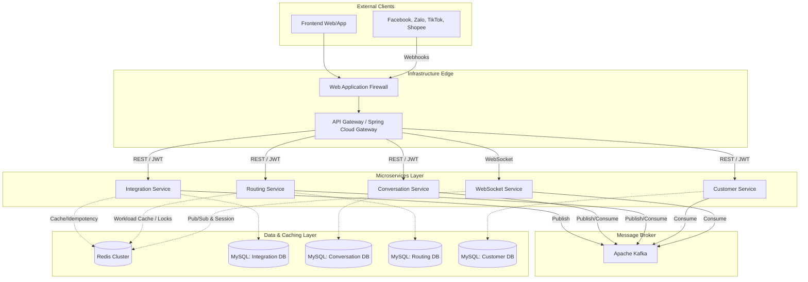
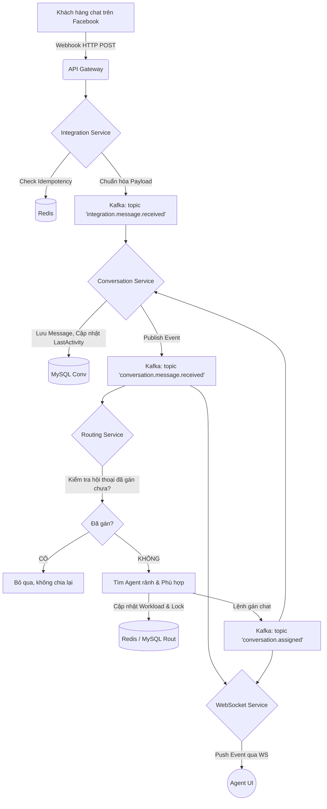
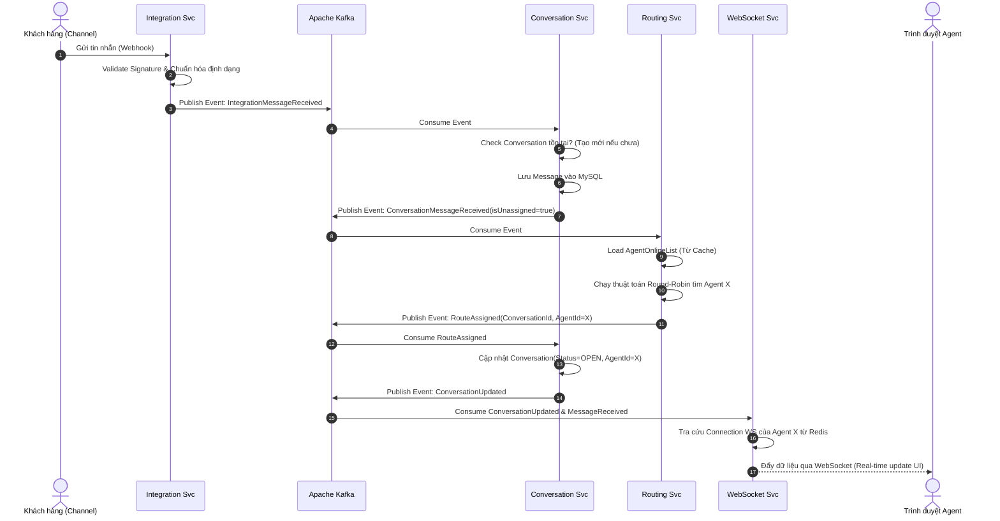

# KIẾN TRÚC HỆ THỐNG BACKEND: OMNICHANNEL CHAT MANAGEMENT (OCM)

## 1. High-Level Design (Thiết kế Bậc cao)

Kiến trúc hệ thống được xây dựng theo mô hình **Event-Driven Microservices**. Các yêu cầu từ bên ngoài (Frontend Web/App và Webhook từ Mạng xã hội) sẽ đi qua một **API Gateway** để định tuyến, xác thực và giới hạn lưu lượng (Rate Limiting). Giao tiếp giữa các dịch vụ bên trong ưu tiên sử dụng **Kafka** để đảm bảo khả năng chịu tải cao và tính lỏng lẻo (loose coupling). 



## 2. Low-Level Design (Thiết kế Bậc thấp)

Bên trong mỗi Microservice, chúng ta áp dụng **Hexagonal Architecture (Ports and Adapters)** kết hợp với Domain-Driven Design để tách biệt hoàn toàn Core Business Logic (Domain) khỏi các công nghệ hạ tầng (Database, Kafka, REST).

```mermaid
classDiagram
    direction LR
    
    package "Infrastructure / Adapters" {
        class RestController
        class KafkaConsumer
        class MySQLRepositoryImpl
        class KafkaPublisherImpl
    }
    
    package "Application (Use Cases)" {
        class ConversationUseCase
        class RoutingUseCase
    }
    
    package "Domain (Core)" {
        class ConversationAggregate
        class DomainServices
        class DomainEvents
        class RepositoryInterface
    }

    RestController --> ConversationUseCase : calls
    KafkaConsumer --> ConversationUseCase : triggers
    
    ConversationUseCase --> ConversationAggregate : orchestrates
    ConversationUseCase --> RepositoryInterface : uses
    ConversationUseCase --> DomainServices : uses
    
    MySQLRepositoryImpl ..|> RepositoryInterface : implements
    KafkaPublisherImpl ..|> DomainEvents : publishes
```

## 3. Service Boundaries (Ranh giới Dịch vụ)

Dựa trên Bounded Contexts đã xác định, hệ thống được chia làm 5 dịch vụ độc lập với cơ sở dữ liệu riêng (Database-per-service pattern):

1. **Integration Service (Cửa ngõ kết nối):**
   - Quản lý quá trình xác thực (OAuth) với Facebook, Zalo, TikTok, Shopee.
   - Lưu trữ và làm mới Access Tokens dài hạn.
   - Chức năng như một Anti-Corruption Layer (ACL): Tiếp nhận Webhook với các định dạng khác nhau của từng nền tảng, chuẩn hóa thành 1 định dạng chuẩn nội bộ, và đẩy vào Kafka (topic `integration.message.received`).

2. **Conversation Service (Dịch vụ Hội thoại cốt lõi):**
   - Quản lý Aggregate `Conversation` và `Message`.
   - Cung cấp API để gửi tin nhắn, lấy lịch sử tin nhắn.
   - Quản lý trạng thái SLA của từng cuộc hội thoại.

3. **Routing Service (Dịch vụ Điều hướng & Giám sát):**
   - Quản lý `AgentRoutingProfile` (Trạng thái Online/Offline, Workload hiện tại).
   - Lắng nghe sự kiện "Có hội thoại mới" để thực thi thuật toán chia chat (Round-Robin, Khách hàng cũ).
   - Chạy các Background Jobs / Scheduler để quét các tin nhắn vi phạm SLA để thu hồi và chuyển giao lại.

4. **Customer Service (Mini CRM):**
   - Quản lý `CustomerProfile` và `ChannelIdentity`.
   - Cung cấp tính năng gộp hồ sơ khách hàng (Merge Profiles) khi phát hiện trùng số điện thoại từ các kênh khác nhau.

5. **WebSocket/Push Service:**
   - Duy trì kết nối hai chiều (TCP Socket) với trình duyệt của Agent.
   - Khi có tin nhắn mới từ Kafka, đẩy (push) tin nhắn real-time xuống đúng màn hình của Agent thông qua Session ID lưu trong Redis.

## 4. Data Flow (Luồng Dữ liệu Xử lý Tin nhắn Đầu vào)

Sơ đồ thể hiện luồng dữ liệu khi một tin nhắn của khách hàng từ Facebook gửi tới hệ thống, được xử lý và hiển thị lên màn hình của Agent.



## 5. Sequence Diagram (Biểu đồ Tuần tự cho Flow Điều hướng)

Chi tiết tương tác giữa các services khi hệ thống nhận tin nhắn mới và tự động gán cho một nhân viên trực tuyến.



## 6. Security Design (Thiết kế Bảo mật)

1. **Authentication & Authorization (Xác thực & Phân quyền):**
   - **Nhân sự (Agents/Admins):** Đăng nhập qua Identity Provider (có thể xây dựng bằng Spring Security OAuth2 / Keycloak). Sử dụng JWT Token ngắn hạn (15 phút) và Refresh Token lưu trữ ở HTTPOnly Cookie.
   - **Xác thực Webhook:** Tất cả payload từ MXH phải được xác thực bằng App Secret/Signature (vd: thuật toán `HMAC-SHA256` của Facebook) ở tầng API Gateway hoặc Integration Service để ngăn chặn giả mạo request.
2. **Data Encryption (Mã hóa dữ liệu):**
   - Toàn bộ Access Token kết nối kênh (Facebook Token, Zalo Token) **bắt buộc** mã hóa AES-256 ở mức ứng dụng trước khi lưu xuống MySQL của Integration Service.
   - Dữ liệu định dạng cá nhân (PII) như Số điện thoại, Email trong Customer DB cần được mã hóa hoặc masking khi hiển thị cho Agent (chỉ Admin/Leader mới được xem toàn bộ).
3. **Idempotency (Tính lũy đẳng):**
   - Các nền tảng MXH thường có cơ chế Retry Webhook nếu mạng chập chờn. API Gateway/Integration Service sử dụng `Provider_Message_ID` làm khóa Idempotency lưu trong Redis (TTL = 24h) để từ chối các tin nhắn xử lý trùng lặp.

## 7. Caching Strategy (Chiến lược Caching)

Sử dụng **Redis** làm bộ nhớ đệm phân tán. Tận dụng tính năng của Spring Data Redis:

- **Routing Workload Cache:** Thông tin về việc Agent nào đang online và đang giữ bao nhiêu cuộc hội thoại sẽ thay đổi liên tục. Không thể query DB liên tục. Do đó, tải làm việc (Workload) được lưu ở Redis và thao tác bằng `INCR`, `DECR` để đảm bảo Atomic operations.
- **Session Cache (WebSocket):** Redis Pub/Sub kết hợp với bộ nhớ Redis được dùng để lưu trữ ánh xạ: `AgentId -> WebSocket Session Server Instance` (Vì WebSocket stateful, ta phải biết Agent kết nối tới Pod nào để gửi tin nhắn nội bộ qua Redis Pub/Sub đến Pod đó).
- **Domain API Caching:** Cache các truy vấn tĩnh như thông tin cấu hình luật Routing (`RoutingRuleConfig`) hoặc thiết lập trả lời nhanh (Quick Replies).

## 8. Messaging Strategy (Apache Kafka)

Kafka đóng vai trò là "Xương sống" (Nerve center) để liên kết các Microservices bằng cơ chế Event-Driven.

*   **Topics Design (Phân mảnh theo Entity & Aggregate):**
    *   `ocm.integration.events` (Partitions: 6, Retention: 7 days)
    *   `ocm.conversation.events` (Partitions: 12, Retention: 7 days)
    *   `ocm.routing.commands` (Partitions: 6, Retention: 3 days)
*   **Partition Key:** Sử dụng `ConversationID` hoặc `ChannelIdentityID` làm khóa phân mảnh (Partition Key) để đảm bảo toàn bộ tin nhắn thuộc về 1 khách hàng luôn rơi vào cùng 1 Partition, đảm bảo thứ tự xử lý (Ordering guarantee) bởi cùng 1 Consumer Thread.
*   **Resiliency & Dead Letter Queue (DLQ):** 
    *   Sử dụng Spring Kafka Error Handling. Nếu xử lý một message bị lỗi (VD: Null Pointer, Timeout DB), message được đẩy sang một Retry Topic nội bộ với Back-off policy.
    *   Sau N lần Retry thất bại, message sẽ bị đẩy vào một `DLQ_Topic` để đội ngũ kỹ thuật xử lý thủ công (Manual Intervention).

## 9. Deployment Architecture (Kiến trúc Triển khai)

Ứng dụng được chứa trong Docker Containers và triển khai trên cụm **Kubernetes (K8s)** để đáp ứng yêu cầu khả dụng 99.9% và xử lý lưu lượng lớn mùa Flash Sale.

*   **Tầng 1 - Ingress Layer:** Sử dụng Nginx Ingress Controller để định tuyến traffic từ Internet vào nội bộ K8s. Cấu hình TLS/SSL tại tầng này.
*   **Tầng 2 - Microservices Pods:**
    *   Các Java 21 Spring Boot 3 apps được đóng gói (Jib hoặc Dockerfile) với lightweight JRE (như Alpine/Eclipse Temurin).
    *   Cấu hình Horizontal Pod Autoscaler (HPA) giám sát CPU/Memory để tự động scale số lượng bản sao (Replicas) của `Integration Service` và `Conversation Service` vào giờ cao điểm.
*   **Tầng 3 - Stateful Services (Managed Cloud Services khuyên dùng):**
    *   **MySQL 8.x:** Sử dụng kiến trúc Master-Slave (1 Primary để Write, n Read Replicas) để chia tách tải đọc ghi (CQRS Pattern ở mức DB).
    *   **Redis & Kafka:** Nên sử dụng Managed Service của Cloud provider (AWS MSK, AWS ElastiCache, hoặc Confluent Cloud) để giảm thiểu rủi ro vận hành hạ tầng stateful phức tạp, thay vì tự host trên K8s. 
*   **Observability:** Tích hợp Prometheus (Metrics) + Grafana (Dashboards), Loki/ELK Stack (Centralized Logging), và OpenTelemetry/Zipkin (Distributed Tracing) để dễ dàng trace lỗi giữa các Microservices.
